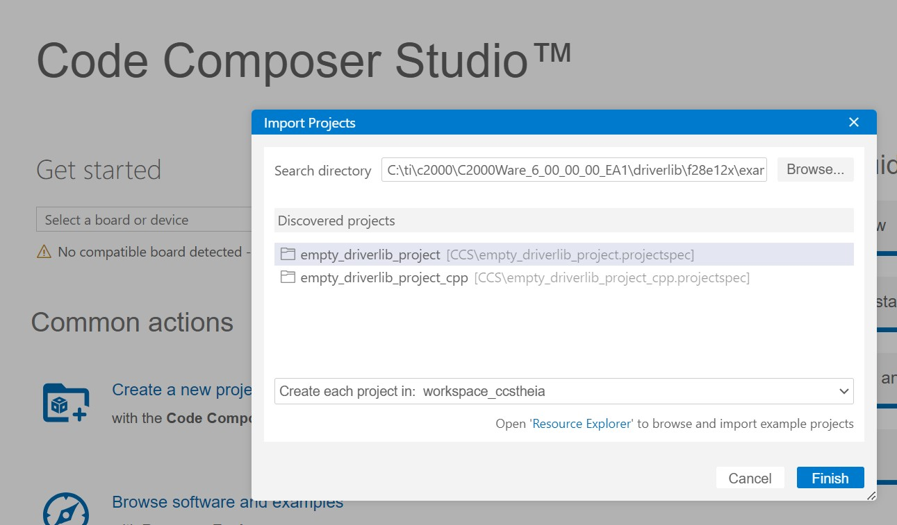
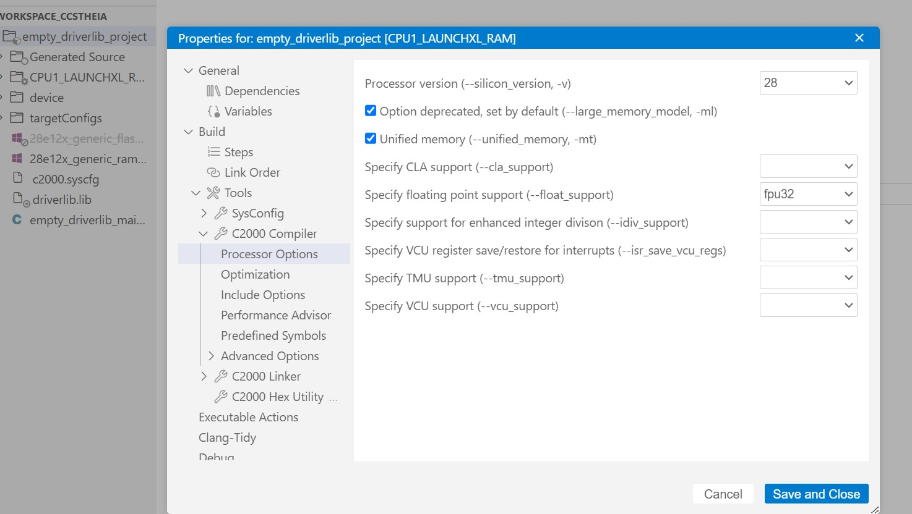
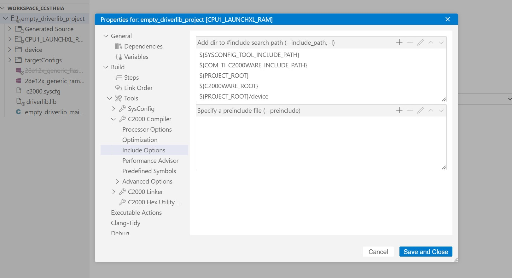
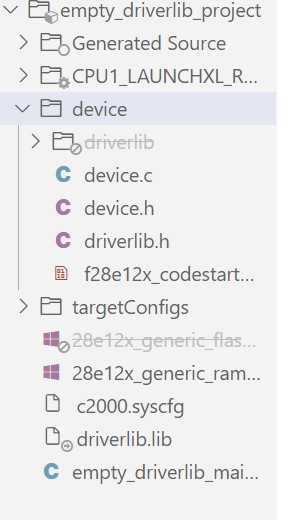

f28p55x Driverib and Example User Guide: Example Introduction

|  |  |  |
| --- | --- | --- |
| [Logo](https://www.ti.com "https://www.ti.com") | f28p55x Driverib and Example User Guide  6.00.01.00 |  |

Example Introduction

### Table of Contents

* [Getting started and Troubleshooting](#autotoc_md179 "#autotoc_md179")

The f28p55x Firmware development library is a group of example applications and helper libraries that demonstrate the basics of getting started with a f28p55x device.

The following section provides a step by step guide project creation for each core as well as debug. It is highly recommended that users new to the f28p55x family of devices start by reading this section first.

The f28p55x devices have a set of example applications that users can load and run on their device.

* The driver library example applications can be found in the driverlib\f28p55x\examples directory.
* The bit-field example applications can be found in the device\_support\f28p55x\examples directory.

As users move past evaluation, and get started developing their own application, TI recommends they maintain a similar project directory structure to that used in the example projects.   
Example projects have a heirarchy as follows:

* Main project directory
  + Project folder
    - Project sources (\*.c, \*.h)
    - CCS folder (ccs)
      * CCS projectspec file

Getting started and Troubleshooting
===================================

This section aims to give you, the user, a step by step guide for how to create and debug projects from scratch. This guide will focus on the user of a f28p55x LaunchPad, but these same ideas should apply to other boards with minimal translation.

* Project Creation

A typical f28p55x application consists of setting up a CCS project, which involves configuring the build settings, file linking, and adding in any source code.

* From the main CCS window select File -$>$ Import Project(s). Browse to the empty project. 

  

  Browse Empty Driverlib project
* Before we can successfully build a project we need to setup some build specific settings. Right click on your project and select Properties. Look at the Processor Options and ensure they match the below image: 

  

  project processor options
* In the C2000 Compiler entry look for and select the Include Options. Click on the add directory icon to add a directory to the search path. Click the File System button to browse to the {driverlib\f28p55x\driverlib} folder of your C2000Ware installation (typically {C:\ti\c2000\C2000Ware\_<version>\driverlib\f28p55x\driverlib}). Click ok to add this path, and repeat this same process to add the { device\_support\f28p55x\common directory.

project include paths

At this point your project workspace should look like the following:

project linker files

* You can edit the file "empty\_driverlib\_main.c" and copy the following code into it:

  #include "driverlib.h"

  #include "device.h"

  void main(void)

  {

  //

  // Initialize device clock and peripherals

  //

  Device\_init();

  //

  // Initialize GPIO and configure the GPIO pin as a push-pull output

  //

  Device\_initGPIO();

  GPIO\_setPadConfig(DEVICE\_GPIO\_PIN\_LED1, GPIO\_PIN\_TYPE\_STD);

  GPIO\_setDirectionMode(DEVICE\_GPIO\_PIN\_LED1, GPIO\_DIR\_MODE\_OUT);

  //

  // Initialize PIE and clear PIE registers. Disables CPU interrupts.

  //

  Interrupt\_initModule();

  //

  // Initialize the PIE vector table with pointers to the shell Interrupt

  // Service Routines (ISR).

  //

  Interrupt\_initVectorTable();

  //

  // Enable Global Interrupt (INTM) and realtime interrupt (DBGM)

  //

  EINT;

  ERTM;

  //

  // Loop Forever

  //

  for(;;)

  {

  //

  // Turn on LED

  //

  GPIO\_writePin(DEVICE\_GPIO\_PIN\_LED1, 0);

  //

  // Delay for a bit.

  //

  DEVICE\_DELAY\_US(500000);

  //

  // Turn off LED

  //

  GPIO\_writePin(DEVICE\_GPIO\_PIN\_LED1, 1);

  //

  // Delay for a bit.

  //

  DEVICE\_DELAY\_US(500000);

  }

  }
* Save thi file and then attempt to build the project by right clicking on it and selecting Build Project. Assuming the project builds, setup a target configuration file for your device (View -> Target Configurations), and try debugging this project on a f28e12x device. When the code runs, you should see the LED blink.

* generated by
   1.9.1
