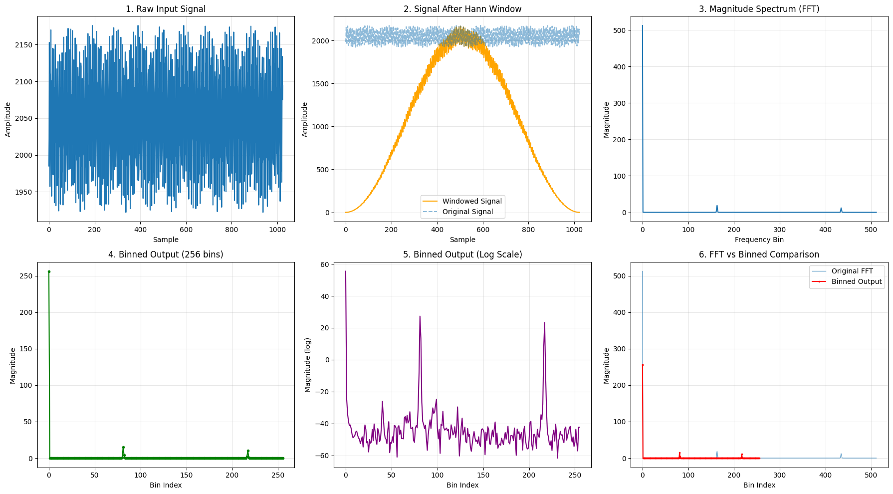
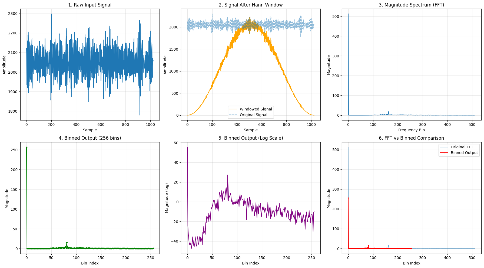
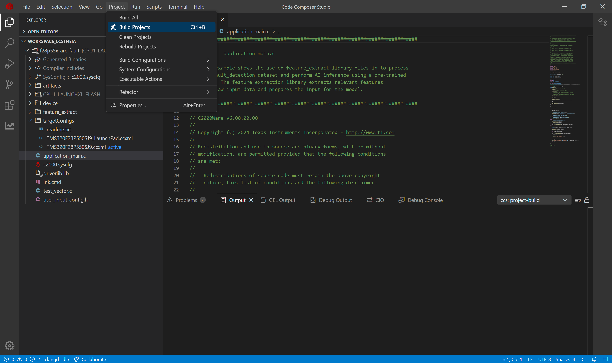
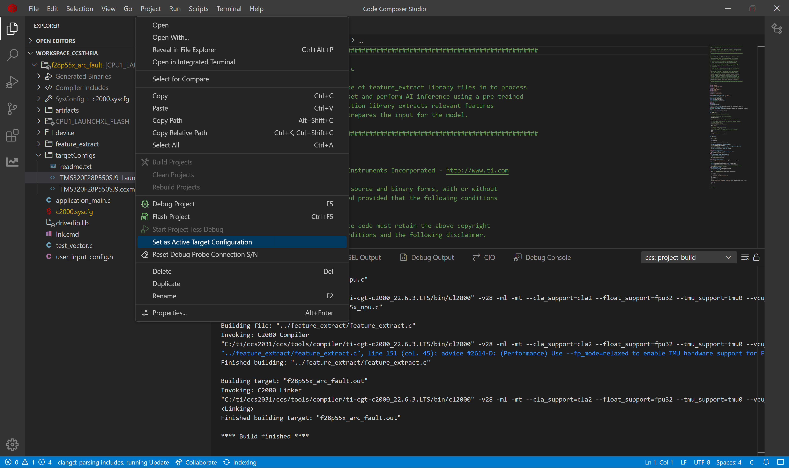
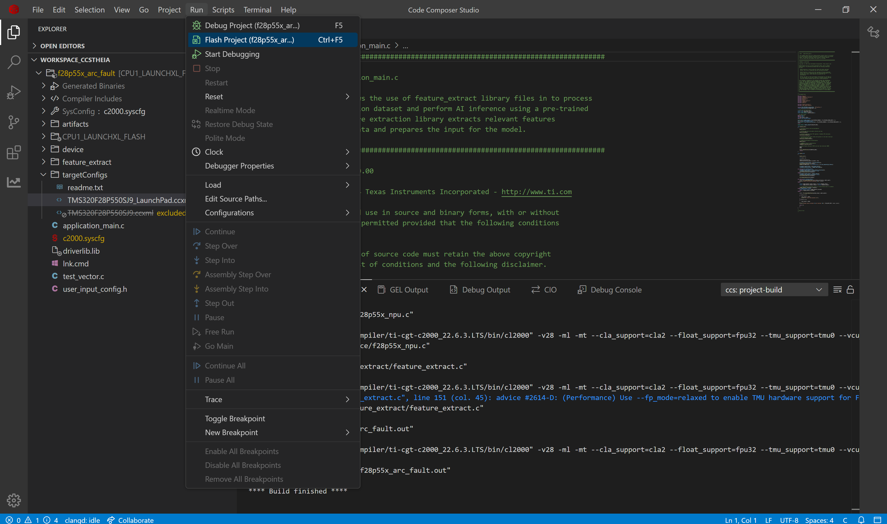
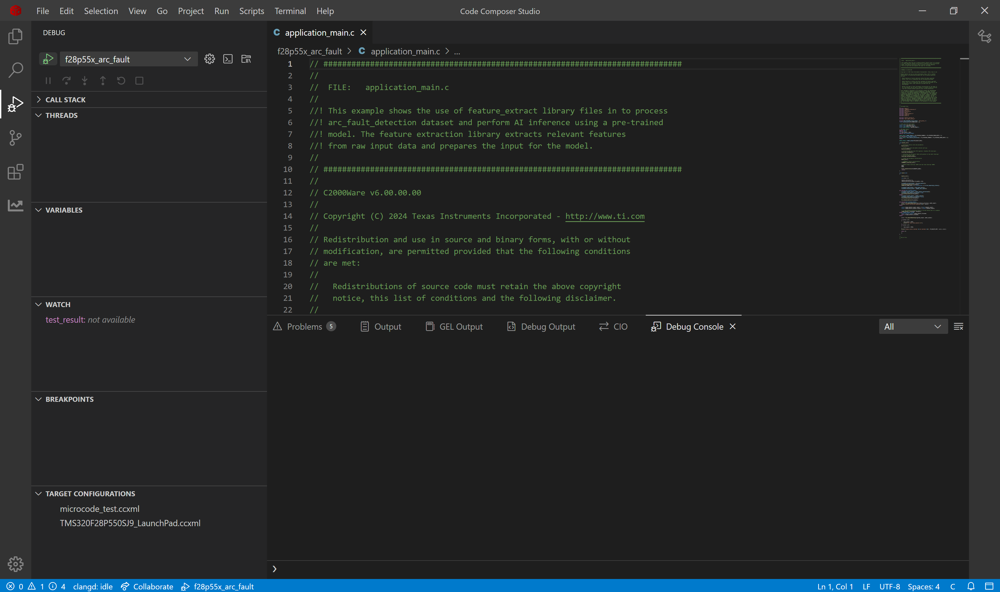
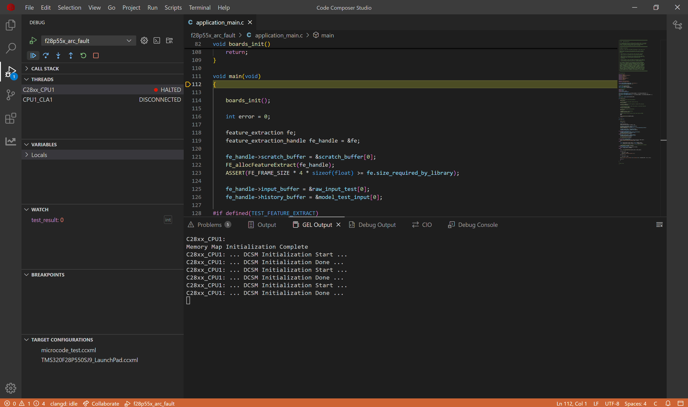
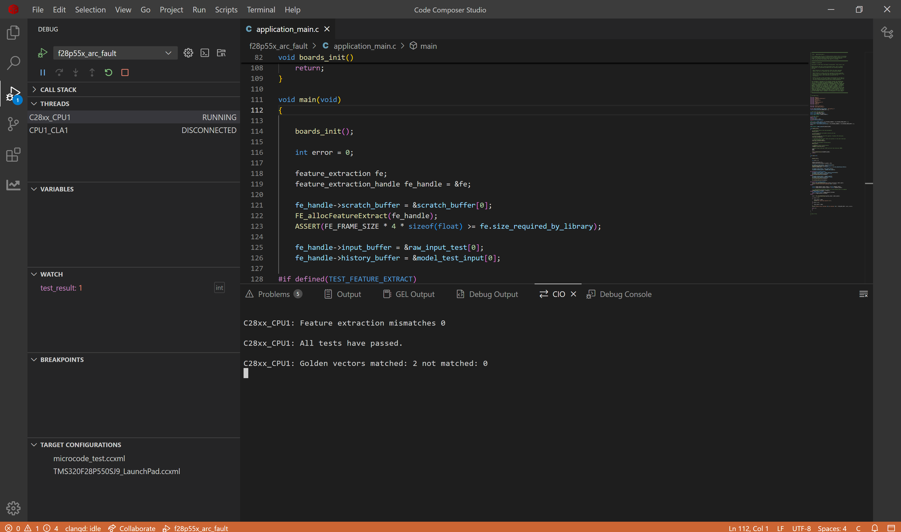

# Arc Fault Detection on C28x Devices

## 1. Purpose

An arc fault is an unintended electrical discharge that occurs when electrical current flows through the air between conductors or from a conductor to ground. It happens when insulation between conductors becomes damaged or deteriorated, creating a path for current to "jump" across a gap. Arc faults generate intense heat (potentially exceeding 10,000°F) that can ignite surrounding materials and cause electrical fires. Unlike short circuits that typically trigger circuit breakers immediately, arc faults may draw current below the trip threshold while still producing dangerous heat. In DC systems like solar installations, arc faults are particularly concerning as they can sustain more easily than in AC systems and may continue until the power source is disconnected.

This project demonstrates implementation of an AI-based arc fault detection system on TI C28x microcontrollers. It showcases how to deploy machine learning models for real-time electrical arc fault classification in embedded systems, helping prevent electrical hazards through early detection of arc faults. The onboard hardware accelerates AI processing faster than software implementations. Complementing this hardware advantage, TI provides a complete development ecosystem with toolchains and SDKs that significantly streamline all stages of Edge AI solution development, allowing customers to rapidly bring safety-critical applications to market.

## 2. Dataset & AI Model Details

### 2.1 **Dataset**

TI has created a specialized arc fault dataset containing DC current measurements. The dataset is divided into two classes: normal operation and arc fault conditions (when electrical arcing occurs between wires). The data is organized into two folders, one for each class. Each folder contains multiple CSV files, with each file storing thousands of current measurement samples in a single column. These sequential measurements provide the necessary data for training effective arc fault detection models.

| Parameter | Value |
|-----------|-------|
| **Sensor** | Current Meter |
| **Channels** | 1 (DC Current) |
| **Samples per File** | Variable: 250,000 |
| **Total Files** | 24 files (12 files in each of 2 classes) |
| **Setup Configurations** | Multiple setup used (0, 1, 2, 3) |
| **Voltage Configurations** | Multiple voltage applied (312 V, 318 V, 607 V) |
| **Current Configurations** | Multiple current drawn (3 A, 8 A, 8.5 A) |

Each file is a CSV (Excel format) with the following structure:

**Columns:**
- Column 1: DC Current Measurement

**Example data (csv): Normal Operation**
```csv
Current
2132
2256
2432
2566
```

### 2.2 **Model Architecture**

This lightweight classification model `CLS_1k_NPU` contains approximately 1,000 parameters and follows a streamlined architecture consisting of four convolutional layers (each enhanced with BatchNorm and ReLU activation functions) followed by a single linear layer. The model is specifically designed to be fully compatible with TI's Neural Processing Unit (NPU) specifications as documented in the [NPU compliance guidelines](https://software-dl.ti.com/mctools/nnc/mcu/users_guide/), adhering to the required m4 channel configuration and maintaining kernel heights of 7 or less.

### 2.3  **Input Features**

The model takes 4D input (N,C,H,W)
  - N (1)    : batch size which is restricted to 1
  - C (1)    : channels which is 1 for single DC current
  - H (256)  : samples of timeseries DC current which is 256 in this example
  - W (1)    : width of samples is restricted to 1 for timeseries applications

### 2.4 **Output Classes**

This model produces a 1D output representing the two possible classes. The position of the highest value in this output indicates the classification result—either normal operation or arc fault condition—providing a straightforward binary classification decision.

### 2.5 **Performance Metrics**

The AI model's memory requirements differ significantly when targeting CPU versus NPU execution. Flash memory stores the model's core components (weights, biases, and architectural definition), while SRAM provides the working memory needed for runtime operations, including input processing and output storage. These memory footprints vary based on the chosen processing unit implementation.

| Configuration | FLASH (B) | SRAM (B) |
|---------------|-----------|----------|
|      CPU      |    4062   |  12320   |
|      NPU      |    3455   |   4256   |

## 3. Project Structure
```
|_ arc_fault
    |_ application_main.c         # Main application containing API calls to Feature Extraction and AI Model
    |_ user_input_config.h        # Flags representing Feature Extraction to apply on the raw input from sensors
    |_ test_vector.c              # Test cases to verify working of Feature Extraction and AI model on device
    |_ lnk.cmd                    # Defines utilization of memory banks
    |_ artifacts
        |_ mod.a                  # Contains the compiled AI model
        |_ tvmgen_default.h       # Exposing APIs to use AI model and model definition
    |_ feature_extract
        |_ feature_extract_c28.c  # Implementation of optimized FFT function
        |_ feature_extract.c      # Implementation of feature extraction
        |_ feature_extract.h      # Exposing APIs to use feature extraction
```

## 4. Feature Extraction Used

Feature extraction transforms raw data into meaningful inputs for our AI model. For this arc fault detection system, our experimental testing revealed that applying FFT to identify frequencies, followed by binning and logarithmic scaling, produces superior results. This approach also reduces the input dimensions for the AI model.

The feature extraction pipeline is configured in the user_input_config.h file, where various processing flags (prefixed with FE_) control the data transformation. In this example we have used the following preset `FFT1024Input_256Feature_1Frame_Full_Bandwidth`. Below is the breakdown of this preset:

- **FE_WIN**: Applies windowing to the data frame using FE_FRAME_SIZE to determine window length. Windowing reduces spectral leakage by smoothing the edges of the signal segment.
- **FE_FFT**: Performs Fast Fourier Transform on the windowed data, calculating magnitude values from complex outputs. FFT converts the time-domain signal into frequency components, which is crucial since arc faults exhibit distinctive frequency signatures.
- **FE_NORMALIZE**: Scales the FFT output by dividing by FE_FRAME_SIZE. Normalization ensures consistent magnitude ranges regardless of input signal strength, improving model robustness.
- **FE_BIN**: Groups normalized frequencies into FE_BIN_SIZE bins, starting from FE_MIN_FFT_BIN. Binning reduces dimensionality while preserving the frequency distribution pattern that distinguishes arc faults.
- **FE_LOG**: Applies logarithmic scaling to the binned frequency data. Log scaling compresses the dynamic range, emphasizing smaller frequency components that might contain critical arc fault indicators.
- **FE_CONCAT**: Combines scaled outputs from multiple data frames (quantity specified by FE_NUM_FRAME_CONCAT). Concatenation provides temporal context by incorporating information from previous frames, helping detect evolving arc fault patterns. The concatenation feature improves detection accuracy but requires additional storage capacity.

In the yaml configuration of modelzoo, we have selected the FFT1024Input_256Feature_1Frame_Full_Bandwidth, which means the feature extraction library will take a data frame of size 1024 and compute FFT of it. Then it will calculate the magnitude of the FFT and result in frame of size 513. Binning will be performed to get the output of size 256, so it will create bins of (513-1)/256 size which is 2 with min_bin_offset of 1. It will do this for 1 frame and concatenate the output from it to finally give us 256 features which is 256 for the AI model.

Within test_vector.c, we've included sample current readings from both normal operation and arc fault conditions. The visualizations below demonstrate how our feature extraction pipeline transforms these raw signals, highlighting the distinct differences between normal operating patterns and arc fault signatures after processing.

### 4.1 Normal Operation


### 4.2 Arc Fault


Notice how the graph for normal condition turns out to be smoother than the one for arc fault. These differences are analyzed further by the AI model to give better results than the traditional methods. Hence improving the detection of arc.

## 5. How to Recreate AI Model

To develop an AI model for arc fault detection, we need a complete workflow that includes dataset loading, pre-processing, model training, validation, and exporting with metadata. TI offers two toolchain options for this process: Edge AI Studio or TinyML Modelzoo. This example demonstrates how to use Modelzoo to generate the necessary artifacts and golden vectors for deployment on C28x devices.

### 5.1 Modelzoo

Setting up modelzoo can be found [here](https://github.com/TexasInstruments/tinyml-tensorlab/tree/main/tinyml-modelzoo).

#### 5.1.1 Step-by-step guide to use TI Modelzoo for model creation

```bash
./run_tinyml_modelzoo.sh examples/dc_arc_fault/config_dsk.yaml
```
- **run_tinyml_modelzoo.sh** : represents the script invoking the modelzoo, takes one argument which is the path of yaml
- **examples/dc_arc_fault/config_dsk.yaml** : path of configuration file to execute

After executing the above command, you can see the modelzoo starts working according to the yaml file passed to it. In the logs you can observe the following
- Downloading the dataset
- Performing feature extraction
- Training of the AI Model
- Quantization Aware Training of the AI model
- Accuracy of the exported quantized model on test data
- Compilation of the model using [TI Neural Network Compiler for MCUs](https://software-dl.ti.com/mctools/nnc/mcu/users_guide/index.html)

At the end of the logs you can find the path of compiled model.

#### 5.1.2 Exporting the model for C28x deployment

From executing the above command you can find the results stored in tinyml-modelmaker. The results for a particular instance have path in the following manner:

- tinyml-modelmaker/data/projects/dc_arc_fault_example_dsk/run/**20260122-102510**/CLS_1k_NPU

The directory marked bold represents the time at which the script was invoked. The target device (such as c28x) has four useful file outputs by ModelMaker.

- `mod.a`: The ONNX model is compiled by tvm to get C files, which are converted into a single mod.a that can run on device.
- `tvmgen_default.h`: Mod.a exposes few APIs to interact with model which are present here. You can use these APIs in your application to run model

- `test_vector.c`: ModelMaker gives a test dataset and the expected output. You can use the model to inference this test dataset and check if the output is matching. 
- `user_input_config.h`: This configuration file has preprocessing flag definitions for the parameters used for feature extraction.

### 5.2 CCS Project

#### 5.2.1 Creating a new project in Code Composer Studio

- Install the [C2000Ware SDK](https://www.ti.com/tool/C2000WARE)
- In research explorer, search for arc_fault project
- Import the project
- Replace the files in CCS Project with the ones generated from modelmaker.

#### 5.2.2 Compiled model files

- mod.a: The compiled model is present in this file. 
  - Path Modelmaker: *tinyml-modelmaker/data/projects/dc_arc_fault_example_dsk/run/20260122-102510/CLS_1k_NPU/compilation/artifacts/mod.a*
  - Path CCS Project: *arc_fault_f28p55x/artifacts/mod.a*
- tvmgen_default.h: Header file to access the model inference APIs from mod.a 
  - Path Modelmaker: *tinyml-modelmaker/data/projects/dc_arc_fault_example_dsk/run/20260122-102510/CLS_1k_NPU/compilation/artifacts/tvmgen_default.h*
  - Path CCS Project: *arc_fault_f28p55x/artifacts/tvmgen_default.h*

#### 5.2.3 Feature Extraction configuration & Test data for device verification

- test_vector.c: Test cases to check if the model works on device currently
  - Path Modelmaker: *tinyml-modelmaker/data/projects/dc_arc_fault_example_dsk/run/20260122-102510/CLS_1k_NPU/training/quantization/golden_vectors/test_vector.c*
  - Path CCS Project: *arc_fault_f28p55x/test_vector.c*
- user_input_config.h: Configuration of feature extraction library in SDK. 
  - Path Modelmaker: *tinyml-modelmaker/data/projects/dc_arc_fault_example_dsk/run/20260122-102510/CLS_1k_NPU/training/quantization/golden_vectors/user_input_config.h*
  - Path CCS Project: *arc_fault_f28p55x/user_input_config.h*

#### 5.2.4 Building the application

After preparing the project, we'll build and flash it to the C28x device. The main application logic resides in 'application_main.c', which contains the code responsible for configuring the feature extraction library and executing the arc fault detection model inference.

1. Now we will build the project. Go to Project Tab -> Select Build Project(s)

2. Connect launchpad F28P55x to your system.

## 6. Deploying on C28x Device

Now we will flash the built project on the device. We will use debug mode to see the result of model inference present in *test_result*.

3. Switch the active target device from **TMS320F28P550SJ9.ccxml** to **TMS320F28P550SJ9_LaunchPad.ccxml**.

4. Flash the built project in device. Go to Run tab -> Select Flash Project

5. After the application is flashed, debug screen will appear. Select the debug icon.

6. Continue the program in debug mode.

7. In the CIO tab of CCS Studio, you can see that 'All tests have passed'



## 7. Performance Analysis

We conducted performance profiling of both the Feature Extraction Library and the AI model on the f28p55x device. The measurements below show the processing cycles required for each component. Note that these values will vary across different devices of c28x. 

| Configuration | FE Cycles | FE Time (us) |  AI Model Cycles | Inference Time (us) |
|---------------|-----------|--------------|------------------|---------------------|
|      CPU      |  245945   |    1639.63   |      1728102     |      11520.68       |
|      NPU      |  250568   |    1670.45   |       147650     |        984.33       |

Notably, the AI model executes 11.7 times faster when running on the NPU compared to CPU implementation.

<hr>
Update history:
[22nd Jan 2026]: Compatible with v1.3 of Tiny ML Modelmaker
