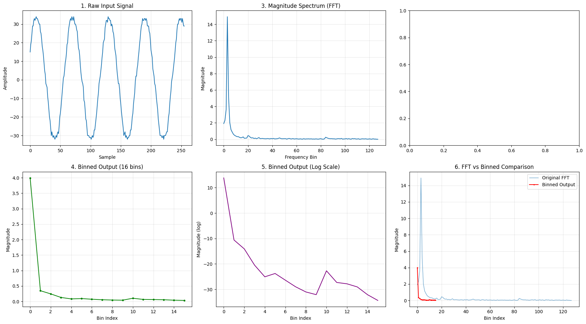
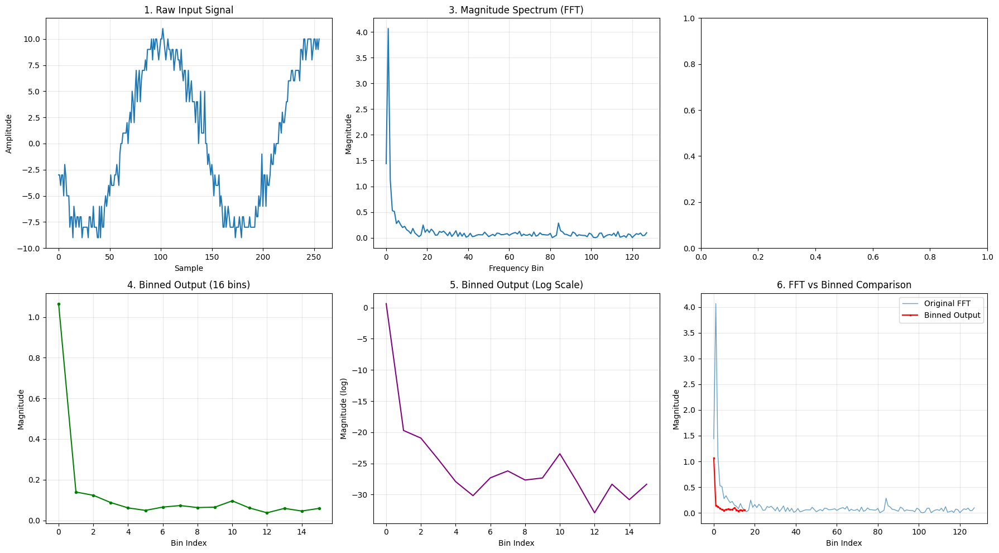
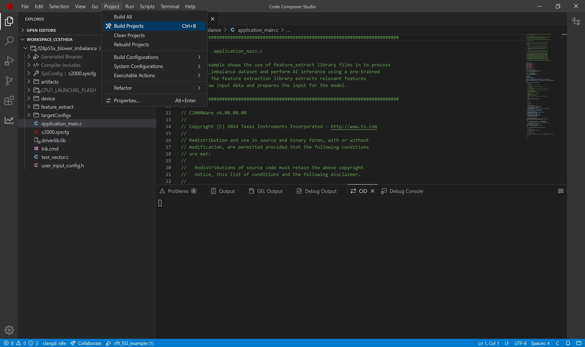
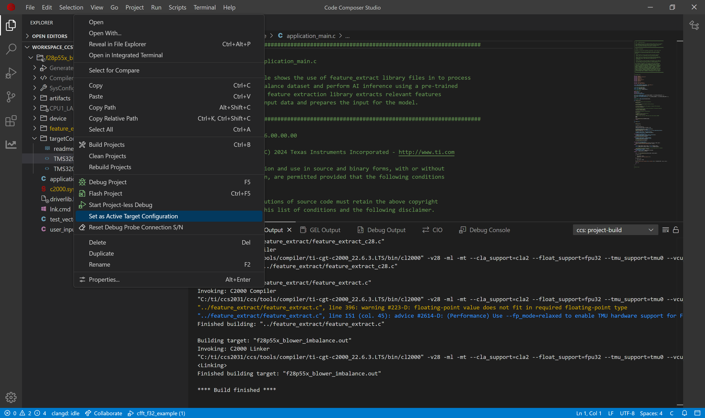
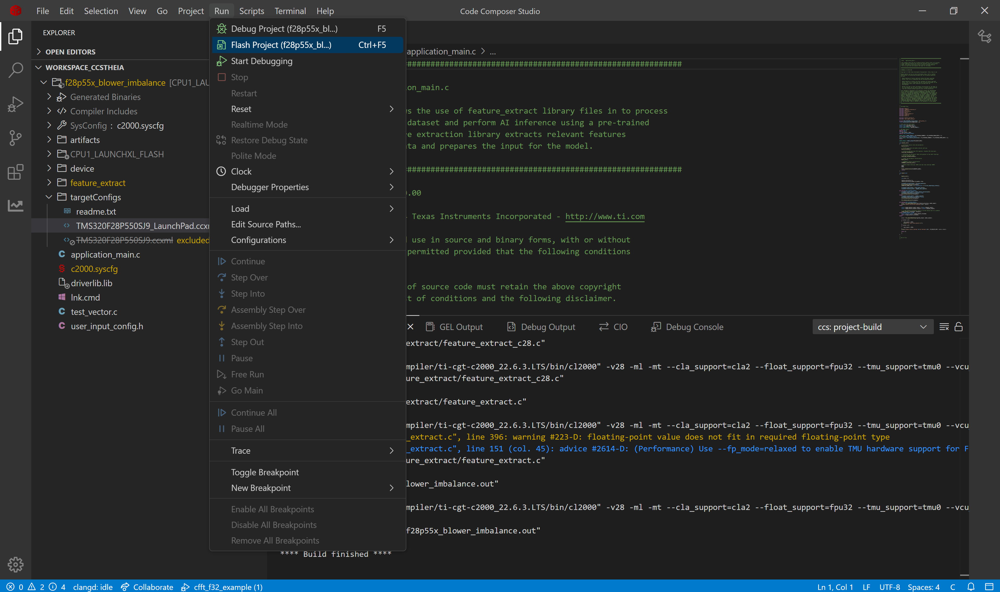
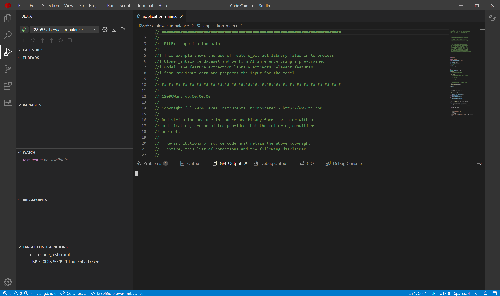
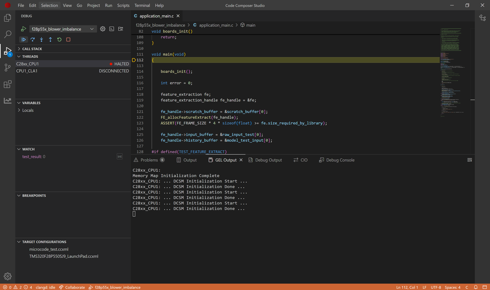
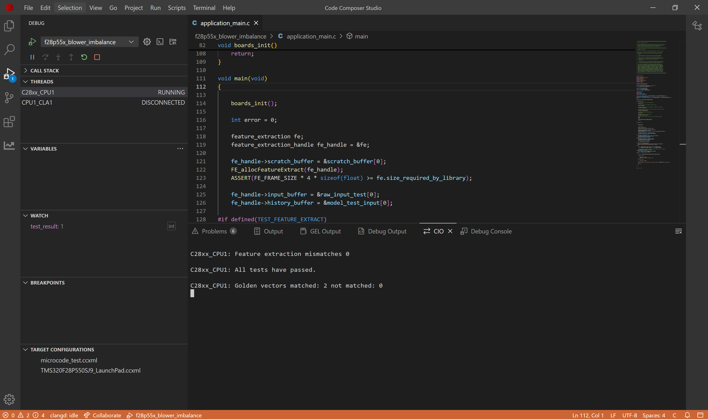

# Blower Imbalance Detection on C28x Devices

## 1. Purpose

Blower Imbalance detection is a classification problem to understand the correct working of the fan blowers. The problem is to identify whether the fans of a running motor have any imbalance is rotation or not. This becomes important to classify in a real world in case of dust accumulation on fan blades, in cooling systems, elevators, lifts or basically anywhere and everywhere there is a running motor. This example uses current readings instead of sensors to do the classification.

This project demonstrates implementation of an AI-based blower imbalance detection system on TI C28x microcontrollers. It showcases how to deploy machine learning models for real-time electrical blower imbalance classification in embedded systems, helping prevent hazards through early detection of faults. The onboard hardware accelerates AI processing faster than software implementations. Complementing this hardware advantage, TI provides a complete development ecosystem with toolchains and SDKs that significantly streamline all stages of Edge AI solution development, allowing customers to rapidly bring safety-critical applications to market.

## 2. Dataset & AI Model Details

### 2.1 **Dataset**

TI has created a specialized blower imbalance dataset containing AC current measurements. The dataset is divided into two classes: normal operation and blower imbalance conditions (when weights are attached to fan). The data is organized into two folders, one for each class. Each folder contains multiple CSV files, with each file storing thousands of current measurement samples in multiple column. These sequential measurements provide the necessary data for training effective blower imbalance detection models.

|         Parameter         |                   Value                 |
|---------------------------|-----------------------------------------|
|        **Sensor**         |                Current Meter            |
|       **Channels**        |               3 (AC Current)            |
|    **Sampling Rates**     |  20 Hz, 30 Hz, 50 Hz, 60 Hz (variable)  |
|   **Samples per File**    | Variable: 36,000 (test), 54,000 (val), 90,000 (train) samples |
|     **Total Files**       | 123 files (69 for normal, 54 for fault) |
| **Motor Configurations**  |          Single test motor (m0)         |

Each file is a CSV (Excel format) with the following structure:

**Columns:**
- Column 0: Time
- Column 1: AC Current Phase 1 Measurement
- Column 2: AC Current Phase 2 Measurement
- Column 3: AC Current Phase 3 Measurement

**Example data (csv): Normal Operation**
```csv
Time,Ia[A],Ib[A],Ic[A]
64641,10,-6,1
64646,11,-7,0
64651,9,-8,0
64656,10,-6,-1
64661,10,-5,-1
```

### 2.2 **Model Architecture**

This lightweight classification model `CLS_1k_NPU` contains approximately 1,000 parameters and follows a streamlined architecture consisting of four convolutional layers (each enhanced with BatchNorm and ReLU activation functions) followed by a single linear layer. The model is specifically designed to be fully compatible with TI's Neural Processing Unit (NPU) specifications as documented in the [NPU compliance guidelines](https://software-dl.ti.com/mctools/nnc/mcu/users_guide/), adhering to the required m4 channel configuration and maintaining kernel heights of 7 or less.

### 2.3  **Input Features**

The model takes 4D input (N,C,H,W)
  - N (1)    : batch size which is restricted to 1
  - C (3)    : channels which is 3 for AC current
  - H (128)  : samples of timeseries AC current which is 128 in this example
  - W (1)    : width of samples is restricted to 1 for timeseries applications

### 2.4 **Output Classes**

This model produces a 1D output representing the two possible classes. The position of the highest value in this output indicates the classification result—either normal operation or blower imbalance condition—providing a straightforward binary classification decision.

### 2.5 **Performance Metrics**

The AI model's memory requirements differ significantly when targeting CPU versus NPU execution. Flash memory stores the model's core components (weights, biases, and architectural definition), while SRAM provides the working memory needed for runtime operations, including input processing and output storage. These memory footprints vary based on the chosen processing unit implementation.

| Configuration | FLASH (B) | SRAM (B) |
|---------------|-----------|----------|
|      CPU      |    3867   |   6176   |
|      NPU      |    3265   |   2192   |

## 3. Project Structure
```
|_ blower_imbalance
    |_ application_main.c         # Main application containing API calls to Feature Extraction and AI Model
    |_ user_input_config.h        # Flags representing Feature Extraction to apply on the raw input from sensors
    |_ test_vector.c              # Test cases to verify working of Feature Extraction and AI model on device
    |_ lnk.cmd                    # Defines utilization of memory banks
    |_ artifacts
        |_ mod.a                  # Contains the compiled AI model
        |_ tvmgen_default.h       # Exposing APIs to use AI model and model definition
    |_ feature_extract
        |_ feature_extract_c28.c  # Implementation of optimized FFT function
        |_ feature_extract.c      # Implementation of feature extraction
        |_ feature_extract.h      # Exposing APIs to use feature extraction
```

## 4. Feature Extraction Used

Feature extraction transforms raw data into meaningful inputs for our AI model. For this blower imbalance detection system, our experimental testing revealed that applying FFT to identify frequencies, followed by binning and logarithmic scaling, produces superior results. This approach also reduces the input dimensions for the AI model.

The feature extraction pipeline is configured in the user_input_config.h file, where various processing flags (prefixed with FE_) control the data transformation. In this example we have used the following preset `Input256_FFTBIN_16Feature_8Frame_3InputChannel_removeDC_2D1`. Below is the breakdown of this preset:

- **FE_FFT**: Performs Fast Fourier Transform on the raw frame, calculating magnitude values from complex outputs. FFT converts the time-domain signal into frequency components, which is crucial since waveforms exhibit distinctive frequency signatures.
- **FE_DC_REM**: Removes the DC component from Fourier transform.
- **FE_BIN**: Groups frequencies into FE_BIN_SIZE bins, starting from FE_MIN_FFT_BIN. Binning reduces dimensionality while preserving the frequency distribution pattern that distinguishes waveforms.
- **FE_BIN_NORMALIZE**: Normalizes the bin using the FE_BIN_SIZE when this flag is present.
- **FE_LOG**: Applies logarithmic scaling to the binned frequency data. Log scaling compresses the dynamic range, emphasizing smaller frequency components that might contain critical waveform indicators.
- **FE_CONCAT**: Combines scaled outputs from multiple data frames (quantity specified by FE_NUM_FRAME_CONCAT). Concatenation provides temporal context by incorporating information from previous frames, helping detect evolving waveform patterns. The concatenation feature improves detection accuracy but requires additional storage capacity.

In the yaml configuration of modelzoo, we have selected the Input256_FFTBIN_16Feature_8Frame_3InputChannel_removeDC_2D1, which means the feature extraction library will take a data frame of size 256 and compute FFT of it. Then it will calculate the magnitude of the FFT and result in frame of size 129. It will remove the DC and result in size of 128. Binning will be performed to get the output of size 16, so it will create bins of 128/16 size which is 8. It will do this for 8 frames and concatenate the output from it to finally give us 16*8 features which is 128 for the AI model.

Within test_vector.c, we've included sample current readings from both normal operation and imbalance conditions. The visualizations below demonstrate how our feature extraction pipeline transforms these raw signals, highlighting the distinct differences between normal operating patterns and imbalance signatures after processing.

### 4.1 Normal Operation


### 4.2 Fault


Notice how the graph for normal condition turns out to be smoother than the one for imbalance. These differences are analyzed further by the AI model to give better results than the traditional methods. Hence improving the detection of imbalance.

## 5. How to Recreate AI Model

To develop an AI model for blower imbalance detection, we need a complete workflow that includes dataset loading, pre-processing, model training, validation, and exporting with metadata. TI offers two toolchain options for this process: Edge AI Studio or TinyML Modelzoo. This example demonstrates how to use Modelzoo to generate the necessary artifacts and golden vectors for deployment on C28x devices.

### 5.1 Modelzoo

Setting up modelzoo can be found [here](https://github.com/TexasInstruments/tinyml-tensorlab/tree/main/tinyml-modelzoo).

#### 5.1.1 Step-by-step guide to use TI Modelzoo for model creation

```bash
./run_tinyml_modelzoo.sh examples/blower_imbalance/config.yaml
```
- **run_tinyml_modelzoo.sh** : represents the script invoking the modelzoo, takes one argument which is the path of yaml
- **examples/blower_imbalance/config.yaml** : path of configuration file to execute

After executing the above command, you can see the modelzoo starts working according to the yaml file passed to it. In the logs you can observe the following
- Downloading the dataset
- Performing feature extraction
- Training of the AI Model
- Quantization Aware Training of the AI model
- Accuracy of the exported quantized model on test data
- Compilation of the model using [TI Neural Network Compiler for MCUs](https://software-dl.ti.com/mctools/nnc/mcu/users_guide/index.html)

At the end of the logs you can find the path of compiled model.

#### 5.1.2 Exporting the model for C28x deployment

From executing the above command you can find the results stored in tinyml-modelmaker. The results for a particular instance have path in the following manner:

- tinyml-modelmaker/data/projects/fan_blower_imbalance_dsh/run/**20260122-102510**/CLS_1k_NPU

The directory marked bold represents the time at which the script was invoked. The target device (such as c28x) has four useful file outputs by ModelMaker.

- `mod.a`: The ONNX model is compiled by tvm to get C files, which are converted into a single mod.a that can run on device.
- `tvmgen_default.h`: Mod.a exposes few APIs to interact with model which are present here. You can use these APIs in your application to run model

- `test_vector.c`: ModelMaker gives a test dataset and the expected output. You can use the model to inference this test dataset and check if the output is matching. 
- `user_input_config.h`: This configuration file has preprocessing flag definitions for the parameters used for feature extraction.

### 5.2 CCS Project

#### 5.2.1 Creating a new project in Code Composer Studio

- Install the [C2000Ware SDK](https://www.ti.com/tool/C2000WARE)
- In research explorer, search for blower_imbalance project
- Import the project
- Replace the files in CCS Project with the ones generated from modelmaker.

#### 5.2.2 Compiled model files

- mod.a: The compiled model is present in this file. 
  - Path Modelmaker: *tinyml-modelmaker/data/projects/fan_blower_imbalance_dsh/run/20260122-102510/CLS_1k_NPU/compilation/artifacts/mod.a*
  - Path CCS Project: *blower_imbalance_f28p55x/artifacts/mod.a*
- tvmgen_default.h: Header file to access the model inference APIs from mod.a 
  - Path Modelmaker: *tinyml-modelmaker/data/projects/fan_blower_imbalance_dsh/run/20260122-102510/CLS_1k_NPU/compilation/artifacts/tvmgen_default.h*
  - Path CCS Project: *blower_imbalance_f28p55x/artifacts/tvmgen_default.h*

#### 5.2.3 Feature Extraction configuration & Test data for device verification

- test_vector.c: Test cases to check if the model works on device currently
  - Path Modelmaker: *tinyml-modelmaker/data/projects/fan_blower_imbalance_dsh/run/20260122-102510/CLS_1k_NPU/training/quantization/golden_vectors/test_vector.c*
  - Path CCS Project: *blower_imbalance_f28p55x/test_vector.c*
- user_input_config.h: Configuration of feature extraction library in SDK. 
  - Path Modelmaker: *tinyml-modelmaker/data/projects/fan_blower_imbalance_dsh/run/20260122-102510/CLS_1k_NPU/training/quantization/golden_vectors/user_input_config.h*
  - Path CCS Project: *blower_imbalance_f28p55x/user_input_config.h*

#### 5.2.4 Building the application

After preparing the project, we'll build and flash it to the C28x device. The main application logic resides in 'application_main.c', which contains the code responsible for configuring the feature extraction library and executing the blower imbalance detection model inference.

1. Now we will build the project. Go to Project Tab -> Select Build Project(s)

2. Connect launchpad F28P55x to your system.

## 6. Deploying on C28x Device

Now we will flash the built project on the device. We will use debug mode to see the result of model inference present in *test_result*.

3. Switch the active target device from **TMS320F28P550SJ9.ccxml** to **TMS320F28P550SJ9_LaunchPad.ccxml**.

4. Flash the built project in device. Go to Run tab -> Select Flash Project

5. After the application is flashed, debug screen will appear. Select the debug icon.

6. Continue the program in debug mode.

7. In the CIO tab of CCS Studio, you can see that 'All tests have passed'



## 7. Performance Analysis

We conducted performance profiling of both the Feature Extraction Library and the AI model on the f28p55x device. The measurements below show the processing cycles required for each component. Note that these values will vary across different devices of c28x. 

| Configuration | FE Cycles | FE Time (us) |  AI Model Cycles | Inference Time (us) |
|---------------|-----------|--------------|------------------|---------------------|
|      CPU      |   48042   |     320.28   |      1003725     |        6691.50      |
|      NPU      |   48087   |     320.58   |        97055     |         647.03      |

Notably, the AI model executes 10.3 times faster when running on the NPU compared to CPU implementation.

<hr>
Update history:
[22nd Jan 2026]: Compatible with v1.3 of Tiny ML Modelmaker
