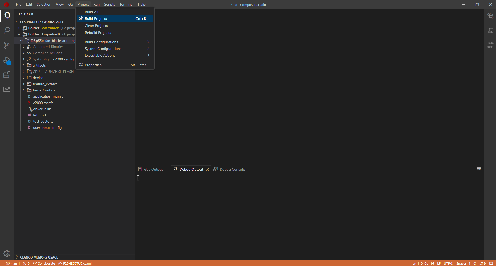
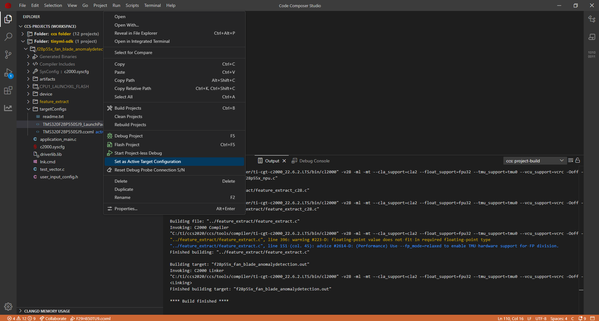
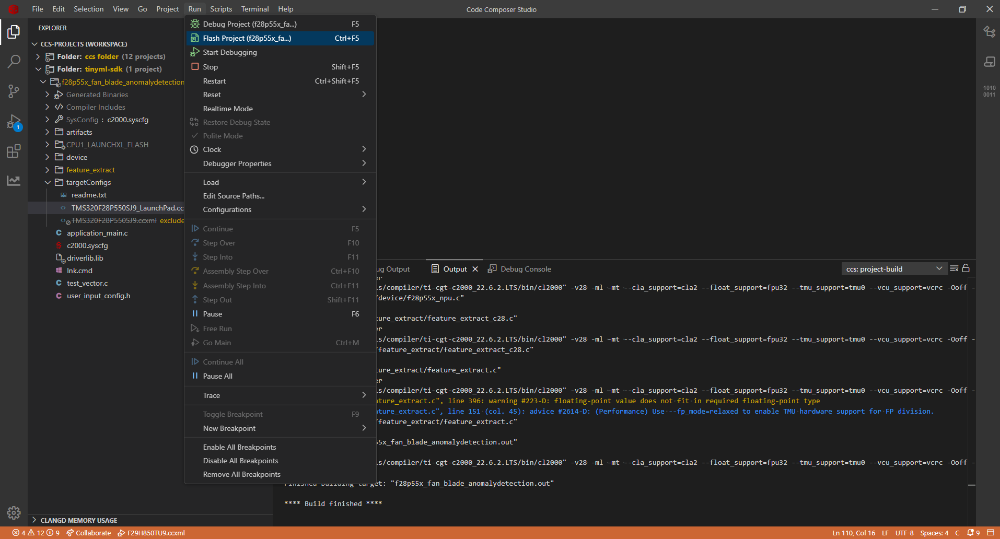
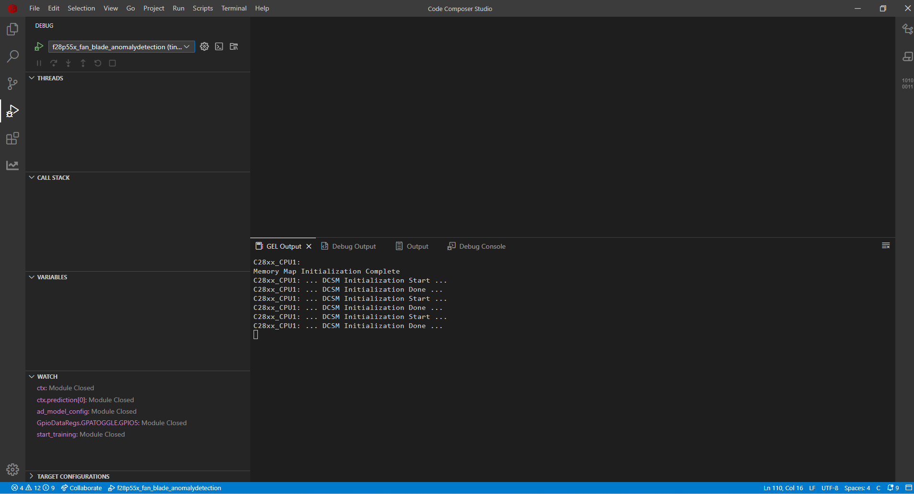
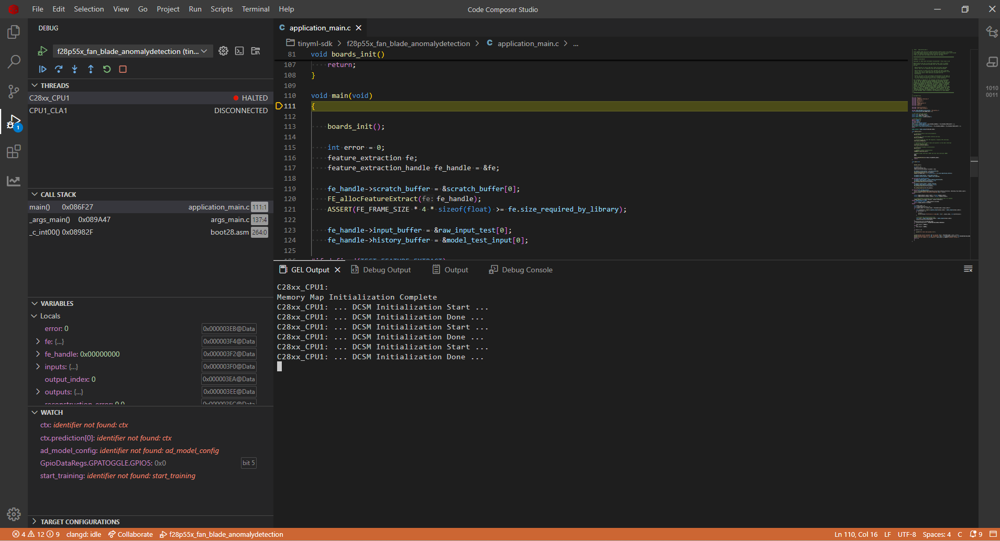
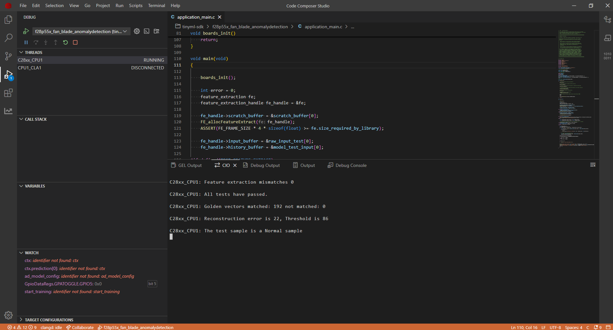

# Fan Blade Anomaly Detection on C28x Devices

## 1. Purpose

Fan blade faults such as imbalance, damage, and obstruction can lead to reduced efficiency, increased energy consumption, and potential system failure. Early detection of these anomalies through vibration analysis enables predictive maintenance, preventing costly downtime and extending equipment lifespan.

This project demonstrates implementation of an AI-based fan blade anomaly detection system on TI C28x microcontrollers. It uses an autoencoder model trained only on normal vibration data to detect deviations that indicate potential faults — including fault types never seen during training. TI provides a complete development ecosystem with toolchains and SDKs that significantly streamline all stages of Edge AI solution development.

## 2. Dataset & AI Model Details

### 2.1 **Dataset**

TI has created a fan blade vibration dataset collected using a 3-axis ADXL355 accelerometer. The dataset captures both normal operation and various fault conditions. The data is organized into two folders: Normal and Anomaly. The Anomaly folder contains three types of faults — blade imbalance, blade damage, and blade obstruction.

| Parameter | Value |
|-----------|-------|
| **Sensor** | ADXL355 3-axis Accelerometer |
| **Sampling Rate** | 4 kHz |
| **Channels** | 3 (Vibration X, Y, Z axes) |
| **Samples per File** | ~20,000 samples (~5 seconds of data) |
| **Total Files** | 287 files (100 Normal, 187 Anomaly) |

**Important:** For anomaly detection, the model is trained only on normal data. All anomaly samples are used exclusively for testing.

Each file is a CSV with the following structure:

**Columns:**
- Column 1: Time (automatically excluded during processing)
- Column 2: Vibration X-axis
- Column 3: Vibration Y-axis
- Column 4: Vibration Z-axis

**Example data (csv): Normal Operation**
```csv
Time,Vibx,Viby,Vibz
0,1022,2056,62993
1,418,3870,64459
2,918,3721,63433
3,550,4300,63963
4,670,4994,63202
5,687,3545,63462
```

### 2.2 **Model Architecture**

This autoencoder model `AD_17k` contains approximately 17,000 parameters. The encoder compresses the input vibration features into a compact representation, and the decoder reconstructs the features from this representation. During training, the model learns to reconstruct normal vibration patterns with low error. When presented with anomalous vibration data, the reconstruction error is significantly higher.

### 2.3  **Input Features**

The model takes 4D input (N,C,H,W)
  - N (1)    : batch size which is restricted to 1
  - C (3)    : channels which is 3 for vibration X, Y, Z axes
  - H (64)   : features per channel (16 frequency bins × 4 concatenated frames)
  - W (1)    : width of samples is restricted to 1 for timeseries applications

### 2.4 **Output**

Unlike classification models that output class probabilities, this model produces a **reconstructed feature vector** of the same shape as the input (1, 3, 64, 1). The reconstruction error (Mean Squared Error between input and output) is then compared against a threshold to determine if the input is normal or anomalous.

```
if reconstruction_error > threshold:
    → ANOMALY
else:
    → NORMAL
```

The threshold value is stored in `user_input_config.h` as `RECONSTRUCTION_ERROR_THRESHOLD`.

### 2.5 **Performance Metrics**

Flash memory stores the model's core components (weights, biases, and architectural definition), while SRAM provides the working memory needed for runtime operations, including input processing and output storage.

| Configuration | FLASH (B) | SRAM (B) |
|---------------|-----------|----------|
|      CPU      |   25584   |   2192   |

## 3. Project Structure
```
|_ fan_blade_anomalydetection
    |_ application_main.c         # Main application containing API calls to Feature Extraction and AI Model
    |_ user_input_config.h        # Feature extraction configuration and reconstruction error threshold
    |_ test_vector.c              # Test cases to verify working of Feature Extraction and AI model on device
    |_ lnk.cmd                    # Defines utilization of memory banks
    |_ artifacts
        |_ mod.a                  # Contains the compiled AI model
        |_ tvmgen_default.h       # Exposing APIs to use AI model and model definition
    |_ feature_extract
        |_ feature_extract_c28.c  # Implementation of optimized FFT function
        |_ feature_extract.c      # Implementation of feature extraction
        |_ feature_extract.h      # Exposing APIs to use feature extraction
```

## 4. Feature Extraction Used

Feature extraction transforms raw vibration data into meaningful inputs for our AI model. For this fan blade anomaly detection system, our experimental testing revealed that applying FFT to identify frequencies, followed by binning and logarithmic scaling, produces superior results. This approach also reduces the input dimensions for the AI model.

The feature extraction pipeline is configured in the `user_input_config.h` file, where various processing flags (prefixed with FE_) control the data transformation. In this example we have used the following preset `Input256_FFTBIN_16Feature_8Frame_3InputChannel_removeDC_2D1`. Below is the breakdown of this preset:

- **FE_FFT**: Performs Fast Fourier Transform on the raw frame, calculating magnitude values from complex outputs. FFT converts the time-domain vibration signal into frequency components, which is crucial since fan blade faults exhibit distinctive frequency signatures.
- **FE_DC_REM**: Removes the DC component from Fourier transform.
- **FE_BIN**: Groups frequencies into FE_BIN_SIZE bins, starting from FE_MIN_FFT_BIN. Binning reduces dimensionality while preserving the frequency distribution pattern that distinguishes normal from faulty operation.
- **FE_BIN_NORMALIZE**: Normalizes the bin using the FE_BIN_SIZE when this flag is present.
- **FE_LOG**: Applies logarithmic scaling to the binned frequency data. Log scaling compresses the dynamic range, emphasizing smaller frequency components that might contain critical fault indicators.
- **FE_CONCAT**: Combines scaled outputs from multiple data frames (quantity specified by FE_NUM_FRAME_CONCAT). Concatenation provides temporal context by incorporating information from previous frames, helping detect evolving vibration patterns.

In the yaml configuration of modelzoo, we have selected the Input256_FFTBIN_16Feature_8Frame_3InputChannel_removeDC_2D1, which means the feature extraction library will take a data frame of size 256 and compute FFT of it. Then it will calculate the magnitude of the FFT and result in frame of size 129. It will remove the DC and result in size of 128. Binning will be performed to get the output of size 16, so it will create bins of 128/16 size which is 8. It will do this for 4 frames and concatenate the output from it to finally give us 16 * 4 features which is 64 per channel. With 3 channels (X, Y, Z), the total input to the AI model is 3*64 = 192 features.

Within test_vector.c, we've included sample vibration readings from fan blade operating conditions. The autoencoder learns to reconstruct normal vibration patterns; anomalous conditions produce significantly higher reconstruction error.

## 5. How to Recreate AI Model

To develop an AI model for fan blade anomaly detection, we need a complete workflow that includes dataset loading, pre-processing, model training, validation, and exporting with metadata. TI offers two toolchain options for this process: Edge AI Studio or TinyML Modelzoo. This example demonstrates how to use Modelzoo to generate the necessary artifacts and golden vectors for deployment on C28x devices.

### 5.1 Modelzoo

Setting up modelzoo can be found [here](https://github.com/TexasInstruments/tinyml-tensorlab/tree/main/tinyml-modelzoo).

#### 5.1.1 Step-by-step guide to use TI Modelzoo for model creation

```bash
./run_tinyml_modelzoo.sh examples/fan_blade_fault_classification/config_anomaly_detection.yaml
```
- **run_tinyml_modelzoo.sh** : represents the script invoking the modelzoo, takes one argument which is the path of yaml
- **examples/fan_blade_fault_classification/config_anomaly_detection.yaml** : path of configuration file to execute

After executing the above command, you can see the modelzoo starts working according to the yaml file passed to it. In the logs you can observe the following
- Downloading the dataset
- Performing feature extraction
- Training of the Autoencoder model (on normal data only)
- Quantization Aware Training of the AI model
- Threshold calculation from reconstruction error statistics
- Accuracy and threshold performance metrics on test data
- Compilation of the model using [TI Neural Network Compiler for MCUs](https://software-dl.ti.com/mctools/nnc/mcu/users_guide/index.html)

At the end of the logs you can find the path of compiled model.

#### 5.1.2 Exporting the model for C28x deployment

From executing the above command you can find the results stored in tinyml-modelmaker. The results for a particular instance have path in the following manner:

- tinyml-modelmaker/data/projects/fan_blade_fault/run/**{date-time}**/AD_17k

The directory marked bold represents the time at which the script was invoked. The target device (such as c28x) has four useful file outputs by ModelMaker.

- `mod.a`: The ONNX model is compiled by tvm to get C files, which are converted into a single mod.a that can run on device.
- `tvmgen_default.h`: Mod.a exposes few APIs to interact with model which are present here. You can use these APIs in your application to run model.
- `test_vector.c`: ModelMaker gives a test dataset and the expected output. You can use the model to inference this test dataset and check if the output is matching.
- `user_input_config.h`: This configuration file has preprocessing flag definitions for the parameters used for feature extraction and the reconstruction error threshold.

### 5.2 CCS Project

#### 5.2.1 Creating a new project in Code Composer Studio

- Install the [C2000Ware SDK](https://www.ti.com/tool/C2000WARE)
- In resource explorer, search for fan_blade_anomalydetection project
- Import the project
- Replace the files in CCS Project with the ones generated from modelmaker.

#### 5.2.2 Compiled model files

- mod.a: The compiled model is present in this file. 
  - Path Modelmaker: *tinyml-modelmaker/data/projects/fan_blade_fault/run/{date-time}/AD_17k/compilation/artifacts/mod.a*
  - Path CCS Project: *fan_blade_anomalydetection_f28p55x/artifacts/mod.a*
- tvmgen_default.h: Header file to access the model inference APIs from mod.a 
  - Path Modelmaker: *tinyml-modelmaker/data/projects/fan_blade_fault/run/{date-time}/AD_17k/compilation/artifacts/tvmgen_default.h*
  - Path CCS Project: *fan_blade_anomalydetection_f28p55x/artifacts/tvmgen_default.h*

#### 5.2.3 Feature Extraction configuration & Test data for device verification

- test_vector.c: Test cases to check if the model works on device correctly
  - Path Modelmaker: *tinyml-modelmaker/data/projects/fan_blade_fault/run/{date-time}/AD_17k/training/quantization/golden_vectors/test_vector.c*
  - Path CCS Project: *fan_blade_anomalydetection_f28p55x/test_vector.c*
- user_input_config.h: Configuration of feature extraction library and reconstruction error threshold. 
  - Path Modelmaker: *tinyml-modelmaker/data/projects/fan_blade_fault/run/{date-time}/AD_17k/training/quantization/golden_vectors/user_input_config.h*
  - Path CCS Project: *fan_blade_anomalydetection_f28p55x/user_input_config.h*

#### 5.2.4 Building the application

After preparing the project, we'll build and flash it to the C28x device. The main application logic resides in 'application_main.c', which contains the code responsible for configuring the feature extraction library, executing the autoencoder model inference, computing the reconstruction error, and comparing it against the threshold.

1. Now we will build the project. Go to Project Tab -> Select Build Project(s)

2. Connect launchpad F28P55x to your system.

## 6. Deploying on C28x Device

Now we will flash the built project on the device. We will use debug mode to see the result of model inference present in *test_result*.

3. Switch the active target device from **TMS320F28P550SJ9.ccxml** to **TMS320F28P550SJ9_LaunchPad.ccxml**.

4. Flash the built project in device. Go to Run tab -> Select Flash Project

5. After the application is flashed, debug screen will appear. Select the debug icon.

6. Continue the program in debug mode.

7. In the CIO tab of CCS Studio, you can see the test results including the reconstruction error, threshold, and whether the sample is Normal or Anomaly.


The console output will display:
- Golden vector match results
- The computed reconstruction error
- The threshold value
- Classification of the test sample as Normal or Anomaly


## 7. Performance Analysis

We conducted performance profiling of the AI model on the f28p55x device. The measurements below show the processing cycles required. Note that these values will vary across different devices of c28x. 

| Configuration |   AI Model Cycles | Inference Time (us) |
|---------------| ------------------|---------------------|
|      CPU      |      3177966      |       21186.44      |

<hr>
Update history:
[26th Feb 2026]: Compatible with v1.3 of Tiny ML Modelmaker