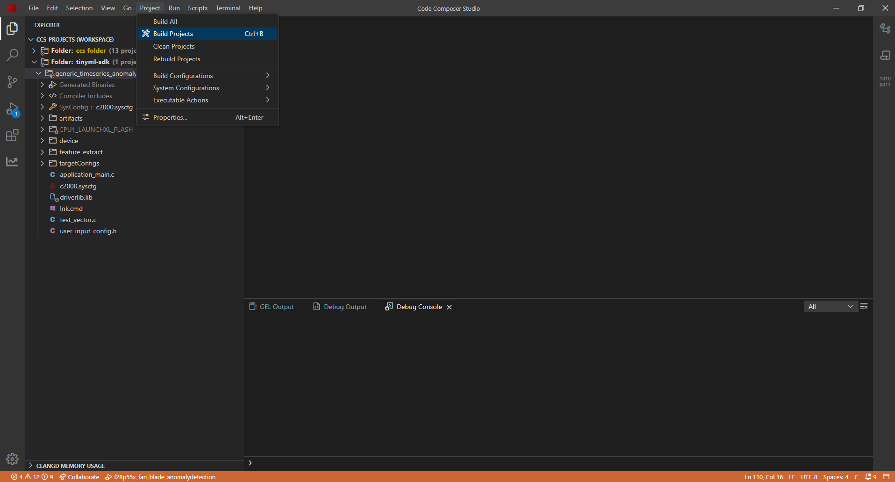
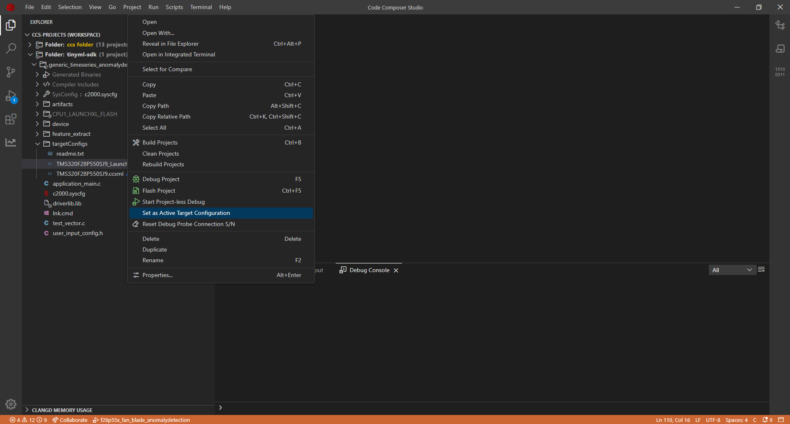
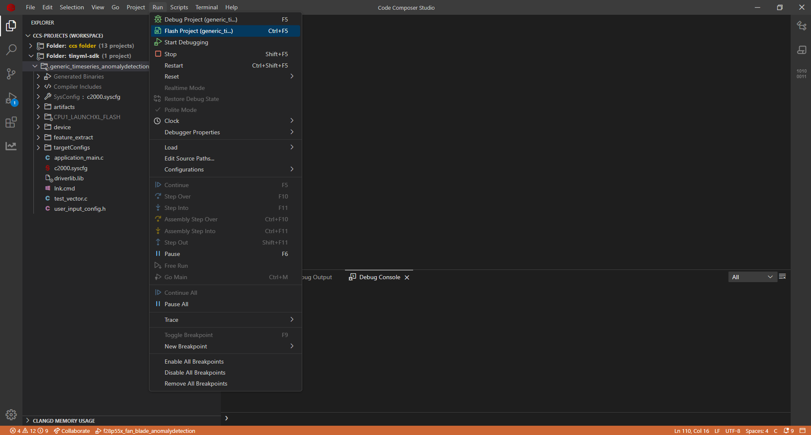
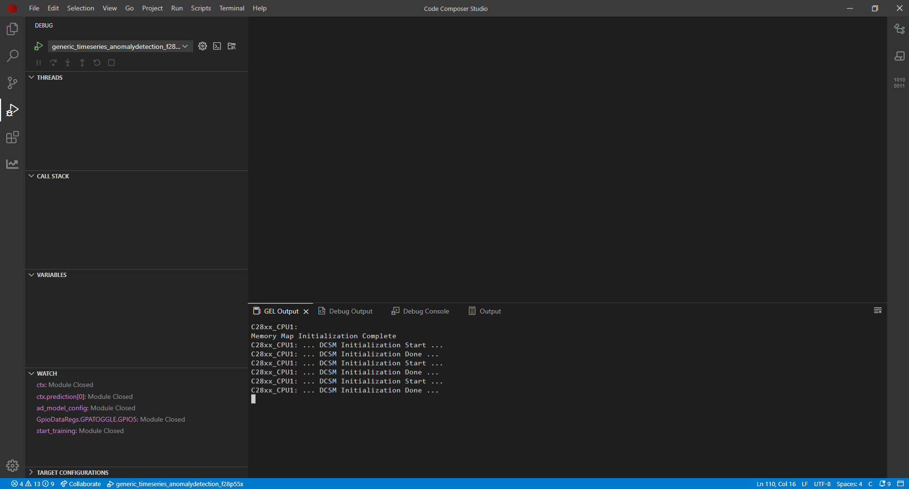
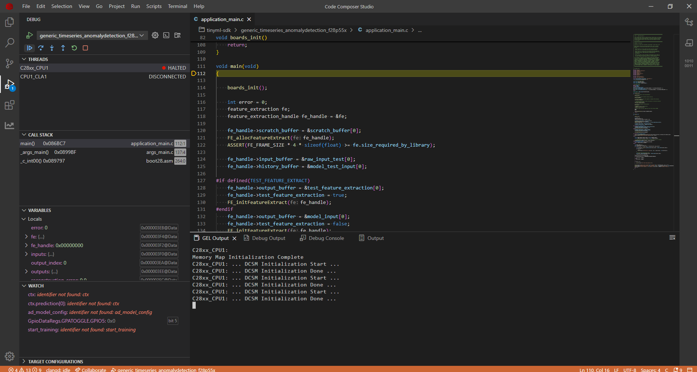
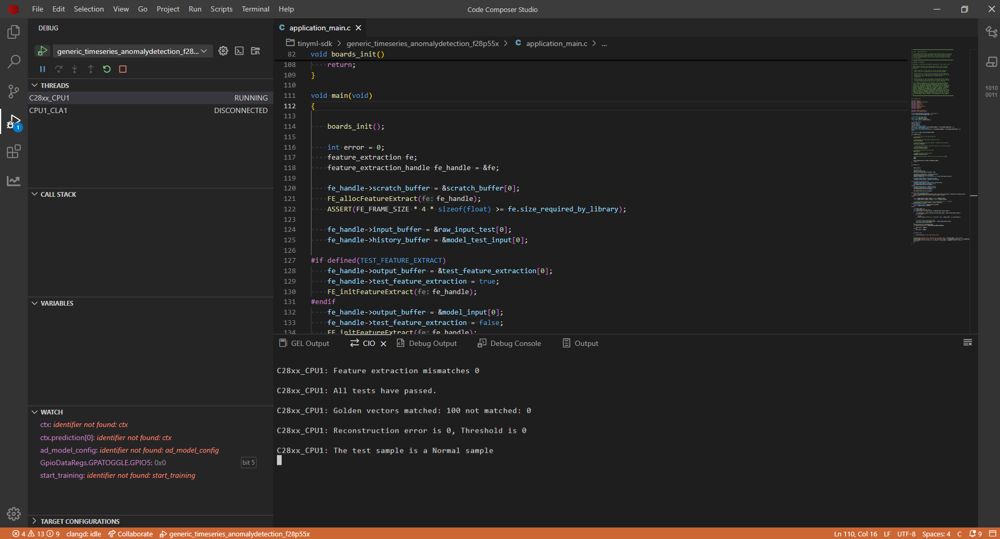

# Generic Timeseries Anomaly Detection on C28x Devices

## 1. Purpose

Generic Timeseries Anomaly Detection is a hello world example for understanding usage of autoencoder-based AI models for anomaly detection on TI MCU. This project demonstrates implementation of an AI-based anomaly detection system on TI C28x microcontrollers using a simple synthetic waveform dataset. Unlike classification models, the autoencoder is trained only on normal data and learns to reconstruct normal patterns. At inference, the reconstruction error between the input and output is compared against a threshold — a high error indicates an anomaly. TI provides a complete development ecosystem with toolchains and SDKs that significantly streamline all stages of Edge AI solution development.

## 2. Dataset & AI Model Details

### 2.1 **Dataset**

TI has created a synthetic waveform dataset based on a combined sinusoidal pattern. The normal signal follows **y = 1.2 sin(2πft) + 0.8 cos(2πft)** with a base frequency of 1.0 Hz. The dataset is divided into two classes: Normal and Anomaly. Anomaly samples include four types of deviations — faster frequency, slower frequency, higher amplitude, and lower amplitude.

The data is organized into two folders, one for each class. Each folder contains multiple CSV files, with each file storing 5000 signal measurement samples.

| Parameter | Value |
|-----------|-------|
| **Sensor** | Signal readings |
| **Sampling Rate** | 100 Hz |
| **Channels** | 1 (signal magnitude) |
| **Samples per File** | 5,000 samples |
| **Total Files** | 92 files (60 Normal, 32 Anomaly) |

**Important:** For anomaly detection, the model is trained only on normal data. Anomaly samples are used exclusively for testing.

Each file is a CSV with the following structure:

**Columns:**
- Column 1: Signal Magnitude

**Example data (csv): Normal Signal**
```csv
signal
0.934627
0.984237
0.961049
1.166310
1.189825
1.122482
```

### 2.2 **Model Architecture**

This autoencoder model `AD_17k` contains approximately 17,000 parameters. The encoder compresses the input signal into a compact representation, and the decoder reconstructs the signal from this representation. During training, the model learns to reconstruct normal patterns with low error. When presented with an anomalous signal, the reconstruction error is significantly higher.

### 2.3 **Input Features**

The model takes 4D input (N,C,H,W)
  - N (1)    : batch size which is restricted to 1
  - C (1)    : channels which is 1 for signal
  - H (100)  : samples of timeseries signal which is 100 in this example
  - W (1)    : width of samples is restricted to 1 for timeseries applications

### 2.4 **Output**

Unlike classification models that output class probabilities, this model produces a **reconstructed signal** of the same shape as the input (1, 1, 100, 1). The reconstruction error (Mean Squared Error between input and output) is then compared against a threshold to determine if the input is normal or anomalous.

```
if reconstruction_error > threshold:
    → ANOMALY
else:
    → NORMAL
```

The threshold value is stored in `user_input_config.h` as `RECONSTRUCTION_ERROR_THRESHOLD`.

### 2.5 **Performance Metrics**

Flash memory stores the model's core components (weights, biases, and architectural definition), while SRAM provides the working memory needed for runtime operations, including input processing and output storage.

| Configuration | FLASH (B) | SRAM (B) |
|---------------|-----------|----------|
|      CPU      |   25481   |  3488    |

## 3. Project Structure
```
|_ generic_timeseries_anomalydetection
    |_ application_main.c         # Main application containing API calls to Feature Extraction and AI Model
    |_ user_input_config.h        # Feature extraction configuration and reconstruction error threshold
    |_ test_vector.c              # Test cases to verify working of Feature Extraction and AI model on device
    |_ lnk.cmd                    # Defines utilization of memory banks
    |_ artifacts
        |_ mod.a                  # Contains the compiled AI model
        |_ tvmgen_default.h       # Exposing APIs to use AI model and model definition
    |_ feature_extract
        |_ feature_extract_c28.c  # Implementation of optimized FFT function
        |_ feature_extract.c      # Implementation of feature extraction
        |_ feature_extract.h      # Exposing APIs to use feature extraction
```

## 4. Feature Extraction Used

Feature extraction transforms raw data into meaningful inputs for our AI model. For this anomaly detection task, our experimental testing revealed that directly using the raw signal with a simple windowing approach produces the best results. The autoencoder learns to reconstruct the temporal shape of the raw waveform, so preserving the original signal structure is critical.

In the modelzoo yaml configuration, the data processing pipeline uses **SimpleWindow** and **Downsample** — the raw signal sampled at 100 Hz is first downsampled to 10 Hz, and then windowed into frames of 100 samples. The downsampling is performed during the data preparation stage in modelzoo, and the generated test vectors already contain data at the downsampled rate. On device, the feature extraction pipeline is configured in the `user_input_config.h` file.

Key configuration parameters:
- **FE_FRAME_SIZE (100)**: Number of samples per window
- **FE_NUM_FRAME_CONCAT (1)**: No frame concatenation
- **FE_VARIABLES (1)**: Single channel input
- **RECONSTRUCTION_ERROR_THRESHOLD (0.0145)**: Threshold for anomaly decision

Within `test_vector.c`, sample signal readings are included to verify the model on device. The normal signal shows a smooth sinusoidal pattern, while anomaly signals exhibit deviations in frequency or amplitude that the autoencoder fails to reconstruct accurately.

## 5. How to Recreate AI Model

To develop an AI model for anomaly detection, we need a complete workflow that includes dataset loading, pre-processing, model training, validation, and exporting with metadata. TI offers two toolchain options for this process: Edge AI Studio or TinyML Modelzoo. This example demonstrates how to use Modelzoo to generate the necessary artifacts and golden vectors for deployment on C28x devices.

### 5.1 Modelzoo

Setting up modelzoo can be found [here](https://github.com/TexasInstruments/tinyml-tensorlab/tree/main/tinyml-modelzoo).

#### 5.1.1 Step-by-step guide to use TI Modelzoo for model creation

```bash
./run_tinyml_modelzoo.sh examples/generic_timeseries_anomalydetection/config.yaml
```
- **run_tinyml_modelzoo.sh** : represents the script invoking the modelzoo, takes one argument which is the path of yaml
- **examples/generic_timeseries_anomalydetection/config.yaml** : path of configuration file to execute

After executing the above command, you can see the modelzoo starts working according to the yaml file passed to it. In the logs you can observe the following
- Downloading the dataset
- Performing Simple Windowing
- Training of the Autoencoder model (on normal data only)
- Quantization Aware Training of the AI model
- Threshold calculation from reconstruction error statistics
- Accuracy and threshold performance metrics on test data
- Compilation of the model

At the end of the logs you can find the path of compiled model.

#### 5.1.2 Exporting the model for C28x deployment

From executing the above command you can find the results stored in tinyml-modelmaker. The results for a particular instance have path in the following manner:

- tinyml-modelmaker/data/projects/generic_timeseries_anomalydetection/run/**{date-time}**/AD_17k

The directory marked bold represents the time at which the script was invoked. The target device (such as c28x) has four useful file outputs by ModelMaker.

- `mod.a`: The ONNX model is compiled by tvm to get C files, which are converted into a single mod.a that can run on device.
- `tvmgen_default.h`: Mod.a exposes few APIs to interact with model which are present here. You can use these APIs in your application to run model.
- `test_vector.c`: ModelMaker gives a test dataset and the expected output. You can use the model to inference this test dataset and check if the output is matching.
- `user_input_config.h`: This configuration file has preprocessing flag definitions for the parameters used for feature extraction and the reconstruction error threshold.

### 5.2 CCS Project

#### 5.2.1 Creating a new project in Code Composer Studio

- Install the [C2000Ware SDK](https://www.ti.com/tool/C2000WARE)
- In resource explorer, search for generic_timeseries_anomalydetection project
- Import the project
- Replace the files in CCS Project with the ones generated from modelmaker.

#### 5.2.2 Compiled model files

- mod.a: The compiled model is present in this file. 
  - Path Modelmaker: *tinyml-modelmaker/data/projects/generic_timeseries_anomalydetection/run/{date-time}/AD_17k/compilation/artifacts/mod.a*
  - Path CCS Project: *generic_timeseries_anomalydetection_f28p55x/artifacts/mod.a*
- tvmgen_default.h: Header file to access the model inference APIs from mod.a 
  - Path Modelmaker: *tinyml-modelmaker/data/projects/generic_timeseries_anomalydetection/run/{date-time}/AD_17k/compilation/artifacts/tvmgen_default.h*
  - Path CCS Project: *generic_timeseries_anomalydetection_f28p55x/artifacts/tvmgen_default.h*

#### 5.2.3 Feature Extraction configuration & Test data for device verification

- test_vector.c: Test cases to check if the model works on device correctly
  - Path Modelmaker: *tinyml-modelmaker/data/projects/generic_timeseries_anomalydetection/run/{date-time}/AD_17k/training/quantization/golden_vectors/test_vector.c*
  - Path CCS Project: *generic_timeseries_anomalydetection_f28p55x/test_vector.c*
- user_input_config.h: Configuration of feature extraction library and reconstruction error threshold. 
  - Path Modelmaker: *tinyml-modelmaker/data/projects/generic_timeseries_anomalydetection/run/{date-time}/AD_17k/training/quantization/golden_vectors/user_input_config.h*
  - Path CCS Project: *generic_timeseries_anomalydetection_f28p55x/user_input_config.h*

#### 5.2.4 Building the application

After preparing the project, we'll build and flash it to the C28x device. The main application logic resides in 'application_main.c', which contains the code responsible for configuring the feature extraction library, executing the autoencoder model inference, computing the reconstruction error, and comparing it against the threshold.

1. Now we will build the project. Go to Project Tab -> Select Build Project(s)

2. Connect launchpad F28P55x to your system.

## 6. Deploying on C28x Device

3. Switch the active target device from **TMS320F28P550SJ9.ccxml** to **TMS320F28P550SJ9_LaunchPad.ccxml**.

4. Flash the built project in device. Go to Run tab -> Select Flash Project

5. After the application is flashed, debug screen will appear. Select the debug icon.

6. Continue the program in debug mode.

7. In the CIO tab of CCS Studio, you can see the test results including the reconstruction error, threshold, and whether the sample is Normal or Anomaly.


The console output will display:
- Golden vector match results
- The computed reconstruction error
- The threshold value
- Classification of the test sample as Normal or Anomaly

## 7. Performance Analysis

We conducted performance profiling of the AI model on the f28p55x device. The measurements below show the processing cycles required. Note that these values will vary across different devices of c28x. 

| Configuration |   Model Cycles | Inference Time (us) |
|---------------|----------------|---------------------|
|      CPU      |   5022228      |      33481.52       |

<hr>
Update history:
[26th Feb 2026]: Compatible with v1.3 of Tiny ML Modelmaker