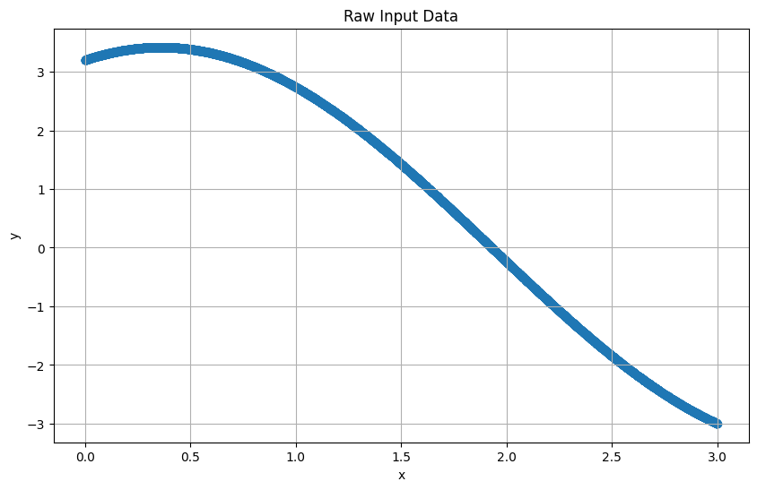
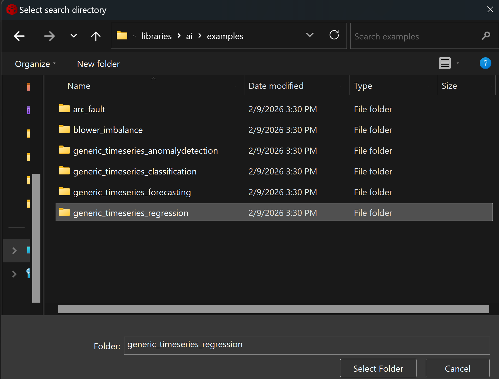
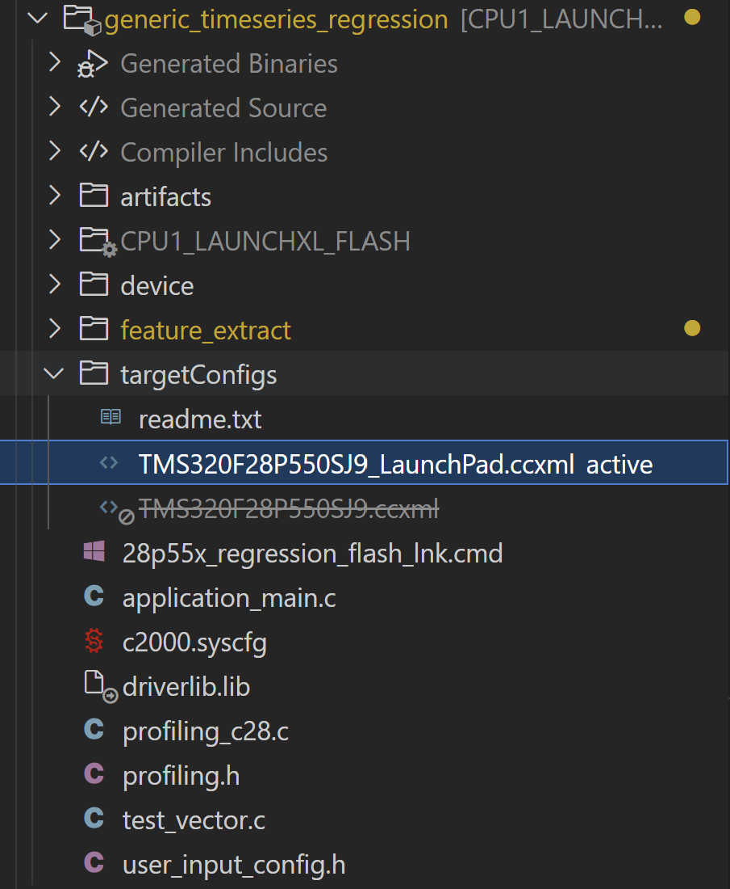
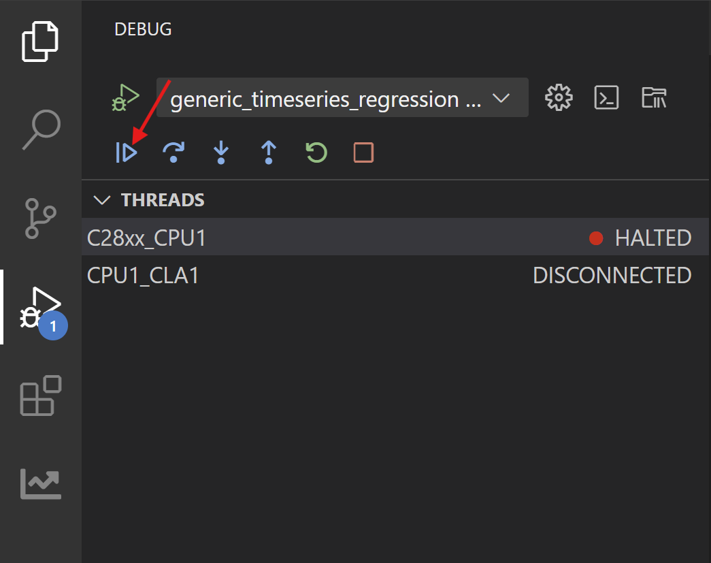
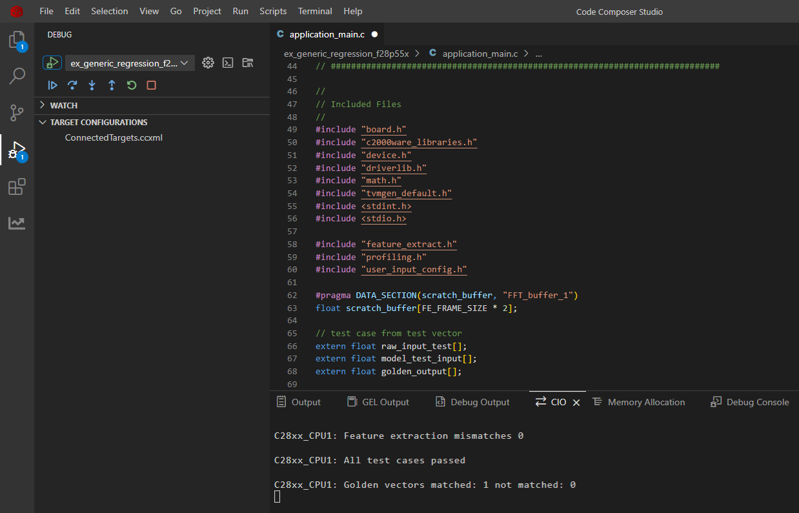

# Generic Timeseries Regression on C28x Devices

## 1. Purpose

Generic Timeseries Regression is a hello world example for understanding usage of regression AI models on TI MCU. We have used a simple regression dataset. It is a synthetic regression dataset built to serve as a hello world model. We also illustrate how to run this example on device.

## 2. Dataset & AI Model Details

### 2.1 **Dataset**

To demonstrate timeseries regression, we use a dummy dataset. This dataset is a independent variable x, where x is randomly generated in range from 0 to 3 and the target variable y = 1.2 sin(x) + 3.2 cos(x)

- x is randomly generated in the range 0 to 3
- target variable y is y = 1.2 sin(x) + 3.2 cos(x)

| Column Name | Description |
|-------------|-------------|
| `x` | randomly generated in range [0,3]|
| `y` | y = 1.2 sin(x) + 3.2 cos(x) |

Each file is a CSV (Excel format) with the following structure:

**Columns:**
- Column 1: x

**Example data (csv): x**
```csv
x
0.14617464242738187
0.8673289793694505
2.1628990404936896
0.06484874974784938
0.6177682958023171
0.1523197700861304
```

### 2.2 **Model Architecture**

This lightweight regression model contains approximately 1,800 parameters and follows a streamlined architecture consisting of one input batch norm layer, 4 convolution layers and 2 fully connected layers.
The model is compatible with TI's Neural Processing Unit (NPU) specifications as documented in the [NPU compliance guidelines](https://software-dl.ti.com/mctools/nnc/mcu/users_guide/).
### 2.3  **Input Features**

The model takes 4D input (N,C,H,W)
  - N (1)    : batch size which is restricted to 1
  - C (1)    : channels which is 1 for signal
  - H (10)  : samples of timeseries signals which is 10 in this example
  - W (1)    : width of samples is restricted to 1 for timeseries applications

### 2.4 **Output**

This model produces a 1D output representing the values of target variable y. 


## 3. Project Structure
```
|_ generic_timeseries_regression
    |_ application_main.c         # Main application containing API calls to Feature Extraction and AI Model
    |_ user_input_config.h        # Flags representing Feature Extraction to apply on the raw input from sensors
    |_ test_vector.c              # Test cases to verify working of Feature Extraction and AI model on device
    |_ lnk.cmd                    # Defines utilization of memory banks
    |_ artifacts
        |_ mod.a                  # Contains the compiled AI model
        |_ tvmgen_default.h       # Exposing APIs to use AI model and model definition
    |_ feature_extract
        |_ feature_extract_c28.c  # Implementation of optimized FFT function
        |_ feature_extract.c      # Implementation of feature extraction
        |_ feature_extract.h      # Exposing APIs to use feature extraction
```

## 4. Feature Extraction 

Feature extraction transforms raw data into meaningful inputs for our AI model. For this regression task, our experimental testing revealed that applying any feature extraction did not tremendously give better performances than directly using input raw signal. However, we have used a SimpleWindow transformation, which makes usage of the previous frame_size 10 is used in this example, to predict the current instance of target variable.

### 4. Raw Data 


The image shows a representation of the target variable y wrt to independent variable x. 

## 5. How to Recreate AI Model

To develop an AI model for regression, we need a complete workflow that includes dataset loading, pre-processing, model training, validation, and exporting with metadata. TI offers two toolchain options for this process: Edge AI Studio or TinyML Modelzoo. This example demonstrates how to use Modelzoo to generate the necessary artifacts and golden vectors for deployment on C28x devices.

### 5.1 Modelzoo

Setting up modelzoo can be found [here](https://github.com/TexasInstruments/tinyml-tensorlab/tree/main/tinyml-modelzoo).

#### 5.1.1 Step-by-step guide to use TI Modelzoo for model creation

```bash
./run_tinyml_modelzoo.sh examples/generic_timeseries_regression/config.yaml
```
- **run_tinyml_modelzoo.sh** : represents the script invoking the modelzoo, takes one argument which is the path of yaml
- **examples/generic_timeseries_regression/config.yaml** : path of configuration file to execute

After executing the above command, you can see the modelzoo starts working according to the yaml file passed to it. In the logs you can observe the following
- Downloading the dataset
- Performing Simple Windowing
- Training of the AI Model
- RMSE of the exported model on test data
- Compilation of the model

At the end of the logs you can find the path of compiled model.

#### 5.1.2 Exporting the model for C28x deployment

From executing the above command you can find the results stored in tinyml-modelmaker. The results for a particular instance have path in the following manner:

- tinyml-modelmaker/data/projects/generic_timeseries_regression/run/**{date-time}**/REGR_2k

The directory marked bold represents the time at which the script was invoked. The target device (such as c28x) has four useful file outputs by ModelMaker.

- `mod.a`: The ONNX model is compiled by tvm to get C files, which are converted into a single mod.a that can run on device.
- `tvmgen_default.h`: Mod.a exposes few APIs to interact with model which are present here. You can use these APIs in your application to run model

- `test_vector.c`: ModelMaker gives a test dataset and the expected output. You can use the model to inference this test dataset and check if the output is matching. 
- `user_input_config.h`: This configuration file has preprocessing flag definitions for the parameters used for feature extraction.

### 5.2 CCS Project

#### 5.2.1 Creating a new project in Code Composer Studio

- Install the [C2000Ware SDK](https://www.ti.com/tool/C2000WARE)
- Open Code Composer Studio
- Import the project
  - Go to **File** > **Import Projects**
  - A dialog box will appear. Click **Browse** to select the project folder.
  - 

- Select the `generic_timeseries_regression` folder from    
  ```
     {C2000Ware_SDK_INSTALL_PATH}/libraries/ai/examples/generic_timeseries_regression
     ```
     

     - Click Finish

- Verify Project Import

  - After importing, the project should appear in the **Project Explorer** panel on the left side of CCS.

  


- Replace the files in CCS Project with the ones generated from modelmaker.

#### 5.2.2 Compiled model files

- mod.a: The compiled model is present in this file. 
  - Path Modelmaker: *tinyml-modelmaker/data/projects/generic_timeseries_regression/run/{date-time}/REGR_2k/compilation/artifacts/mod.a*
  - Path CCS Project: *generic_timeseries_regression/artifacts/mod.a*
- tvmgen_default.h: Header file to access the model inference APIs from mod.a 
  - Path Modelmaker: *tinyml-modelmaker/data/projects/generic_timeseries_regression/run/{date-time}/REGR_2k/compilation/artifacts/tvmgen_default.h*
  - Path CCS Project: *generic_timeseries_regression/artifacts/tvmgen_default.h*

#### 5.2.3 Feature Extraction configuration & Test data for device verification

- test_vector.c: Test cases to check if the model works on device currently
  - Path Modelmaker: *tinyml-modelmaker/data/projects/generic_timeseries_regression/run/{date-time}/REGR_2k/training/quantized/golden_vectors/test_vector.c*
  - Path CCS Project: *generic_timeseries_regression/test_vector.c*
- user_input_config.h: Configuration of feature extraction library in SDK. 
  - Path Modelmaker: *tinyml-modelmaker/data/projects/generic_timeseries_regression/run/{date-time}/REGR_2k/training/quantized/golden_vectors/user_input_config.h*
  - Path CCS Project: *generic_timeseries_regression/user_input_config.h*

#### 5.2.4 Building the application

After preparing the project, we'll build and flash it to the C28x device. The main application logic resides in 'application_main.c', which contains the code responsible for configuring the feature extraction library and executing the inference.

1. In the Project Explorer, expand your project
2. Find the **targetConfigs** folder
3. Right-click on the LaunchPad configuration file (e.g., `TMS320F28P550SJ9_LaunchPad.ccxml`)
4. Select **Set as Active Target Configuration**
5. Right-click on the target configuration > **Build Project**

6. Wait for the build to complete. Check the **Console** panel for any errors.

## 6. Deploying on C28x Device

Now we will flash the built project on the device. 

1. Right click on target config > **Flash Project**

2. After flashing, the debug perspective should open automatically. If not, go to **Run** > **Debug**
3. Click the **Resume** button (blue play button).

&nbsp;&nbsp;&nbsp;&nbsp;

4. Check the Results


## 7. Performance Analysis

We conducted performance profiling of the AI model on the f28p55x device. The measurements below show the processing cycles required. Note that these values will vary across different devices of c28x. 

| Configuration |   Model Cycles | Inference Time (us) |
|---------------|-----------|--------------|
|      CPU      |   31015   |  206.77 |
|      NPU      |   26702   |    178.01    |

We observe that the NPU model is faster compared to the CPU model

<hr>
Update history:
[20th Feb 2026]: Compatible with v1.3 of Tiny ML Modelmaker