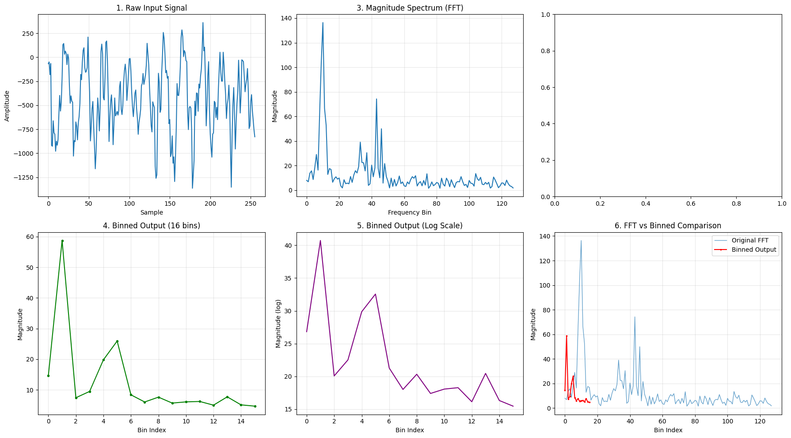
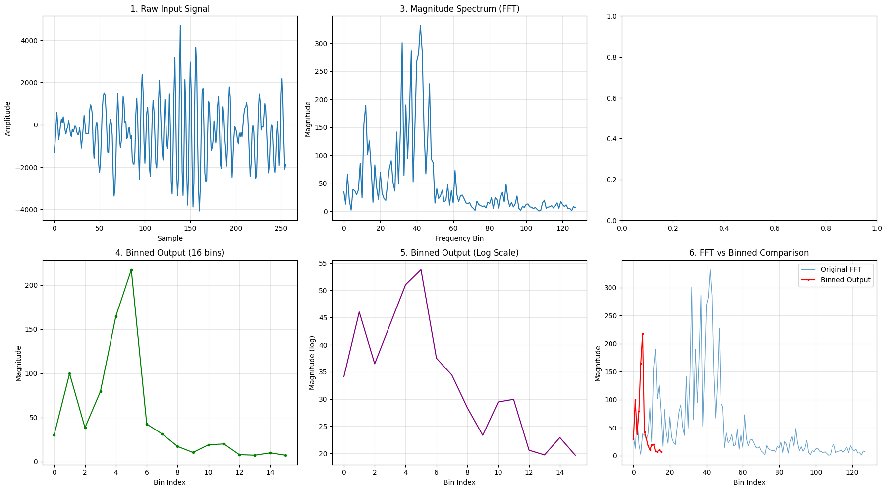
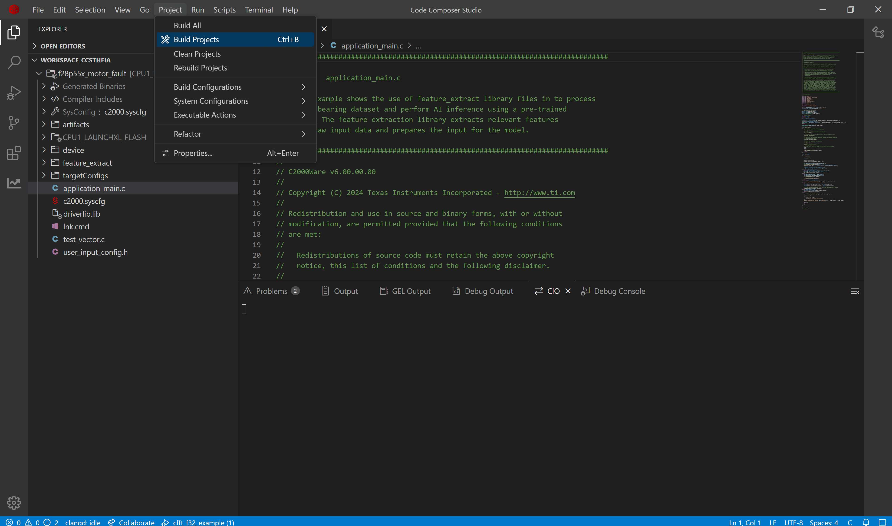
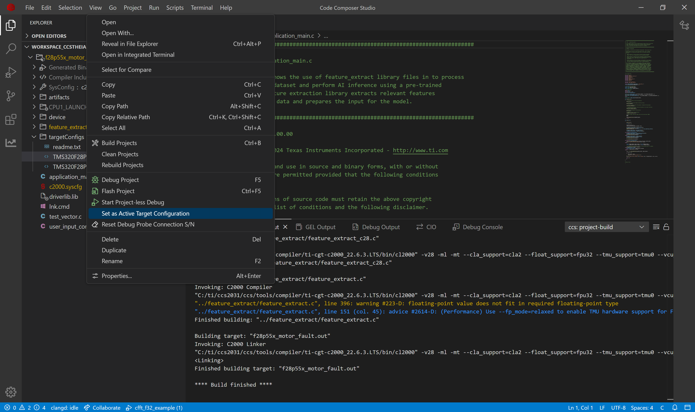
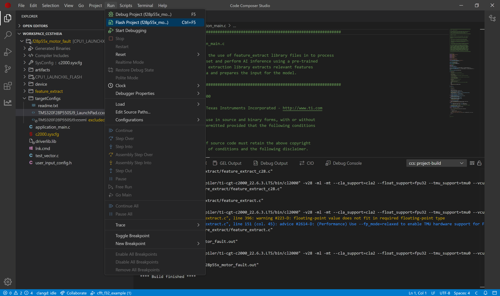
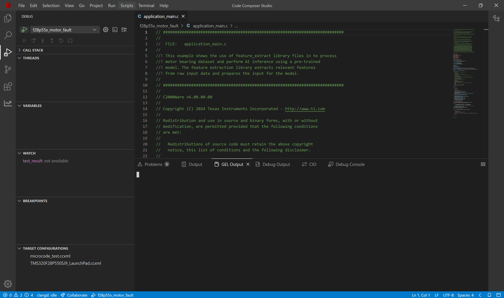
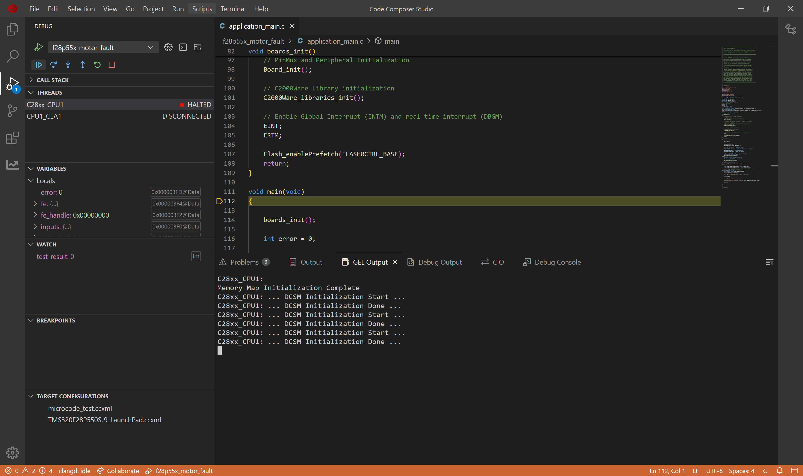
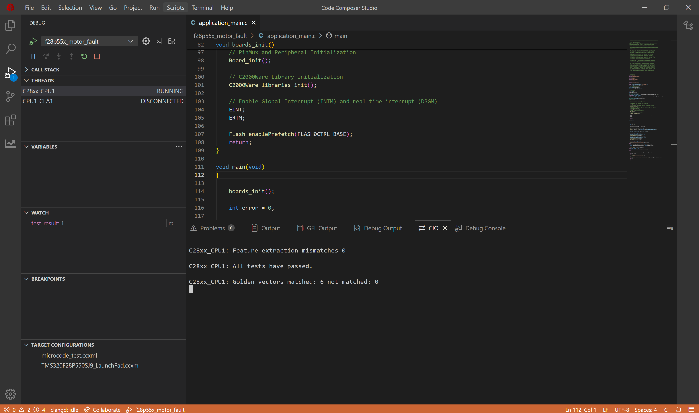

# Motor Fault Detection on C28x Devices

## 1. Purpose

Vibration analysis is a key diagnostic tool for identifying bearing faults in machinery, based on the principle that healthy machines produce specific vibration patterns while deviations signal potential problems. When bearings deteriorate, their smooth motion becomes erratic, causing increased vibration levels and energy output. While basic time-domain measurements provide limited information useful primarily for trending analysis or comparison against standardized criteria, they lack specificity in fault identification.

For more precise diagnosis, frequency analysis is typically employed to determine the exact source of the problem. This advanced method not only detects issues earlier than broadband vibration measurements but also pinpoints which specific component is failing. Such early identification is crucial for maintenance planning, allowing engineers to anticipate critical failures and schedule repairs before catastrophic breakdowns occur, ultimately minimizing costly unplanned downtime.

This project demonstrates implementation of an AI-based motor fault detection system on TI C28x microcontrollers. It showcases how to deploy machine learning models for real-time mechanical motor fault classification in embedded systems, helping prevent hazards through early detection of motor faults. The onboard hardware accelerates AI processing faster than software implementations. Complementing this hardware advantage, TI provides a complete development ecosystem with toolchains and SDKs that significantly streamline all stages of Edge AI solution development, allowing customers to rapidly bring safety-critical applications to market.

## 2. Dataset & AI Model Details

### 2.1 **Dataset**

TI has created a specialized motor fault dataset containing vibrational measurements. The dataset is divided into six classes: bearing normal, bearing contaminated, bearing erosion, bearing flaking, bearing no lubrication, bearing localized fault. The data is organized into six folders, one for each class. Each folder contains multiple CSV files, with each file storing thousands of vibrational measurement samples in a each column. These sequential measurements provide the necessary data for training effective motor fault detection models.

| Parameter | Value |
|-----------|-------|
| **Sensor** | 3-axis accelerometer (X, Y, Z axes) |
| **Sampling Rates** | 10 Hz, 20 Hz, 30 Hz, 40 Hz (variable) |
| **Channels** | 3 (Vibration X, Y, Z axes) |
| **Samples per File** | Variable: 24,000 (test), 72,000 (val), or 144,000 (train) samples |
| **Total Files** | 216 files (36 files in each of 6 classes) |
| **Motor Configurations** | Multiple test motors (m0, m1, m2) |

Each file is a CSV (Excel format) with the following structure:

**Columns:**
- Column 1: Timestamp
- Column 2: Vibration measurement along X-axis
- Column 3: Vibration measurement along Y-axis  
- Column 4: Vibration measurement along Z-axis

**Example data (csv): Healthy bearing**
```csv
Time	Vibx	Viby	Vibz
19393	-492	-470	64040
19394	-510	-491	64085
19395	-436	-585	64122
19396	-268	-565	64173
```

### 2.2 **Model Architecture**

This lightweight classification model contains approximately 1,000 parameters and follows a streamlined architecture consisting of four convolutional layers (each enhanced with BatchNorm and ReLU activation functions) followed by a single linear layer. The model is specifically designed to be fully compatible with TI's Neural Processing Unit (NPU) specifications as documented in the [NPU compliance guidelines](https://software-dl.ti.com/mctools/nnc/mcu/users_guide/), adhering to the required m4 channel configuration and maintaining kernel heights of 7 or less.

### 2.3  **Input Features**

The model takes 4D input (N,C,H,W)
  - N (1)    : batch size which is restricted to 1
  - C (3)    : channels which is 3 for 3 axis vibration data
  - H (128)  : samples of timeseries vibrations which is 128 in this example
  - W (1)    : width of samples is restricted to 1 for timeseries applications

### 2.4 **Output Classes**

This model produces a 1D output representing the six possible classes. The position of the highest value in this output indicates the classification result. If the first element of the array has the highest value, it means the AI model detected it as bearing normal.

### 2.5 **Performance Metrics**

The AI model's memory requirements differ significantly when targeting CPU versus NPU execution. Flash memory stores the model's core components (weights, biases, and architectural definition), while SRAM provides the working memory needed for runtime operations, including input processing and output storage. These memory footprints vary based on the chosen processing unit implementation.

| Configuration | FLASH (B) | SRAM (B) |
|---------------|-----------|----------|
|      CPU      |    4123   |   6176   |
|      NPU      |    3516   |   2192   |

## 3. Project Structure
```
|_ motor_fault
    |_ application_main.c         # Main application containing API calls to Feature Extraction and AI Model
    |_ user_input_config.h        # Flags representing Feature Extraction to apply on the raw input from sensors
    |_ test_vector.c              # Test cases to verify working of Feature Extraction and AI model on device
    |_ lnk.cmd                    # Defines utilization of memory banks
    |_ artifacts
        |_ mod.a                  # Contains the compiled AI model
        |_ tvmgen_default.h       # Exposing APIs to use AI model and model definition
    |_ feature_extract
        |_ feature_extract_c28.c  # Implementation of optimized FFT function
        |_ feature_extract.c      # Implementation of feature extraction
        |_ feature_extract.h      # Exposing APIs to use feature extraction
```

## 4. Feature Extraction Used

Feature extraction transforms raw data into meaningful inputs for our AI model. For this motor fault detection system, our experimental testing revealed that applying FFT to identify frequencies, followed by binning and logarithmic scaling, produces superior results. This approach also reduces the input dimensions for the AI model.

The feature extraction pipeline is configured in the user_input_config.h file, where various processing flags (prefixed with FE_) control the data transformation. In this example we have used the following preset `Input256_FFTBIN_16Feature_8Frame_3InputChannel_removeDC_2D1`. Below is the breakdown of this preset:

- **FE_FFT**: Performs Fast Fourier Transform on the raw frame, calculating magnitude values from complex outputs. FFT converts the time-domain signal into frequency components, which is crucial since motor faults exhibit distinctive frequency signatures.
- **FE_DC_REM**: Removes the DC componenet from Fourier transform.
- **FE_BIN**: Groups frequencies into FE_BIN_SIZE bins, starting from FE_MIN_FFT_BIN. Binning reduces dimensionality while preserving the frequency distribution pattern that distinguishes motor faults.
- **FE_BIN_NORMALIZE**: Normalizes the bin using the FE_BIN_SIZE when this flag is present.
- **FE_LOG**: Applies logarithmic scaling to the binned frequency data. Log scaling compresses the dynamic range, emphasizing smaller frequency components that might contain critical motor fault indicators.
- **FE_CONCAT**: Combines scaled outputs from multiple data frames (quantity specified by FE_NUM_FRAME_CONCAT). Concatenation provides temporal context by incorporating information from previous frames, helping detect evolving motor fault patterns. The concatenation feature improves detection accuracy but requires additional storage capacity.

In the yaml configuration of modelzoo, we have selected the Input256_FFTBIN_16Feature_8Frame_3InputChannel_removeDC_2D1, which means the feature extraction library will take a data frame of size 256 and compute FFT of it. Then it will calculate the magnitude of the FFT and result in frame of size 129. We will remove the DC to get size of 128. Binning will be performed to get the output of size 16, so it will create bins of 128/16 size which is 8. It will do this for 8 frames and concatenate the output from it to finally give us 128 features which is 128 for the AI model.

Within test_vector.c, we've included two sample vibrational readings from each type of bearing conditions. The visualizations below demonstrate how our feature extraction pipeline transforms these raw signals, highlighting the distinct differences between each bearing condition signatures after processing.

### 4.1 Bearing Normal


### 4.2 Bearing Contaminated


Notice how the graph for normal condition turns out to be smoother than the one for contaminated bearing. These differences are analyzed further by the AI model to give better results than the traditional methods. Hence improving the detection of various types of faults.

## 5. How to Recreate AI Model

To develop an AI model for motor fault detection, we need a complete workflow that includes dataset loading, pre-processing, model training, validation, and exporting with metadata. TI offers two toolchain options for this process: Edge AI Studio or TinyML Modelzoo. This example demonstrates how to use Modelzoo to generate the necessary artifacts and golden vectors for deployment on C28x devices.

### 5.1 Modelzoo

Setting up modelzoo can be found [here](https://github.com/TexasInstruments/tinyml-tensorlab/tree/main/tinyml-modelzoo).

#### 5.1.1 Step-by-step guide to use TI Modelzoo for model creation

```bash
./run_tinyml_modelzoo.sh examples/motor_bearing_fault/config.yaml
```
- **run_tinyml_modelzoo.sh** : represents the script invoking the modelzoo, takes one argument which is the path of yaml
- **examples/motor_bearing_fault/config.yaml** : path of configuration file to execute

After executing the above command, you can see the modelzoo starts working according to the yaml file passed to it. In the logs you can observe the following
- Downloading the dataset
- Performing feature extraction
- Training of the AI Model
- Quantization Aware Training of the AI model
- Accuracy of the exported quantizaed model on test data
- Compilation of the model using [TI Neural Network Compiler for MCUs](https://software-dl.ti.com/mctools/nnc/mcu/users_guide/index.html)

At the end of the logs you can find the path of compiled model.

#### 5.1.2 Exporting the model for C28x deployment

From executing the above command you can find the results stored in tinyml-modelmaker. The results for a particular instance have path in the following manner:

- tinyml-modelmaker/data/projects/motor_fault_example_dsk/run/**20260122-102510**/CLS_1k_NPU

The directory marked bold represents the time at which the script was invoked. The target device (such as c28x) has four useful file outputs by ModelMaker.

- `mod.a`: The ONNX model is compiled by tvm to get C files, which are converted into a single mod.a that can run on device.
- `tvmgen_default.h`: Mod.a exposes few APIs to interact with model which are present here. You can use these APIs in your application to run model

- `test_vector.c`: ModelMaker gives a test dataset and the expected output. You can use the model to inference this test dataset and check if the output is matching. 
- `user_input_config.h`: This configuration file has preprocessing flag definitions for the parameters used for feature extraction.

### 5.2 CCS Project

#### 5.2.1 Creating a new project in Code Composer Studio

- Install the [C2000Ware SDK](https://www.ti.com/tool/C2000WARE)
- In research explorer, search for motor_fault project
- Import the project
- Replace the files in CCS Project with the ones generated from modelmaker.

#### 5.2.2 Compiled model files

- mod.a: The compiled model is present in this file. 
  - Path Modelmaker: *tinyml-modelmaker/data/projects/motor_fault_example_dsk/run/20260122-102510/CLS_1k_NPU/compilation/artifacts/mod.a*
  - Path CCS Project: *motor_fault_f28p55x/artifacts/mod.a*
- tvmgen_default.h: Header file to access the model inference APIs from mod.a 
  - Path Modelmaker: *tinyml-modelmaker/data/projects/motor_fault_example_dsk/run/20260122-102510/CLS_1k_NPU/compilation/artifacts/tvmgen_default.h*
  - Path CCS Project: *motor_fault_f28p55x/artifacts/tvmgen_default.h*

#### 5.2.3 Feature Extraction configuration & Test data for device verification

- test_vector.c: Test cases to check if the model works on device currently
  - Path Modelmaker: *tinyml-modelmaker/data/projects/motor_fault_example_dsk/run/20260122-102510/CLS_1k_NPU/training/quantization/golden_vectors/test_vector.c*
  - Path CCS Project: *motor_fault_f28p55x/test_vector.c*
- user_input_config.h: Configuration of feature extraction library in SDK. 
  - Path Modelmaker: *tinyml-modelmaker/data/projects/motor_fault_example_dsk/run/20260122-102510/CLS_1k_NPU/training/quantization/golden_vectors/user_input_config.h*
  - Path CCS Project: *motor_fault_f28p55x/user_input_config.h*

#### 5.2.4 Building the application

After preparing the project, we'll build and flash it to the C28x device. The main application logic resides in 'application_main.c', which contains the code responsible for configuring the feature extraction library and executing the motor fault detection model inference.

1. Now we will build the project. Go to Project Tab -> Select Build Project(s)

2. Connect launchpad F28P55x to your system.

## 6. Deploying on C28x Device

Now we will flash the built project on the device. We will use debug mode to see the result of model inference present in *test_result*.

3. Switch the active target device from **TMS320F28P550SJ9.ccxml** to **TMS320F28P550SJ9_LaunchPad.ccxml**.

4. Flash the built project in device. Go to Run tab -> Select Flash Project

5. After the application is flashed, debug screen will appear. Select the debug icon.

6. Continue the program in debug mode.

7. In the CIO tab of CCS Studio, you can see that 'All tests have passed'



## 7. Performance Analysis

We conducted performance profiling of both the Feature Extraction Library and the AI model on the f28p55x device. The measurements below show the processing cycles required for each component. Note that these values will vary across different devices of c28x. 

| Configuration | FE Cycles | FE Time (us) |  AI Model Cycles | Inference Time (us) |
|---------------|-----------|--------------|------------------|---------------------|
|      CPU      |   68567   |     457.11   |      1004648     |       6697.65       |
|      NPU      |   69761   |     465.07   |        99955     |        666.36       |

Notably, the AI model executes 10.5 times faster when running on the NPU compared to CPU implementation.

<hr>
Update history:
[22nd Jan 2026]: Compatible with v1.3 of Tiny ML Modelmaker
