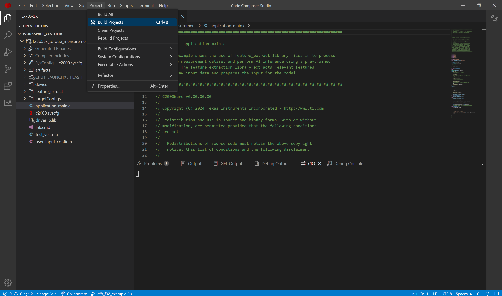
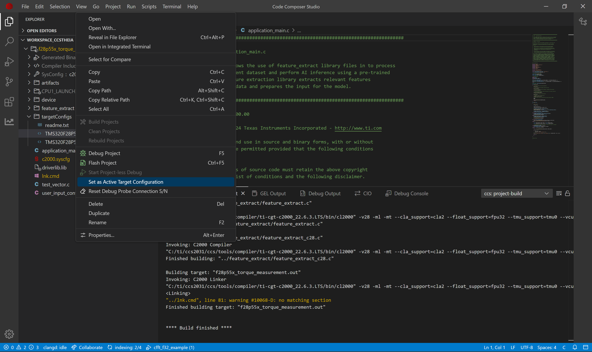
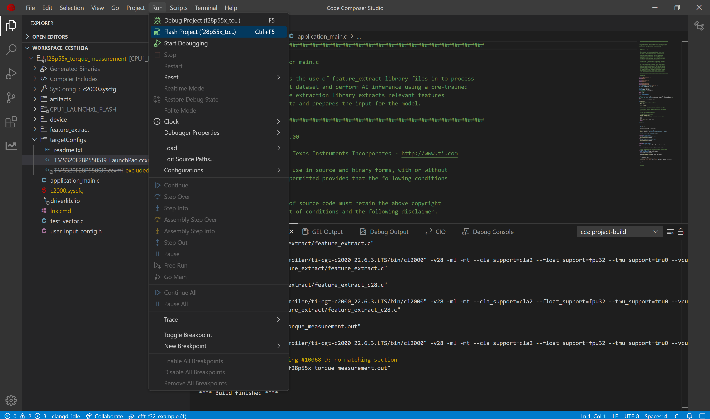
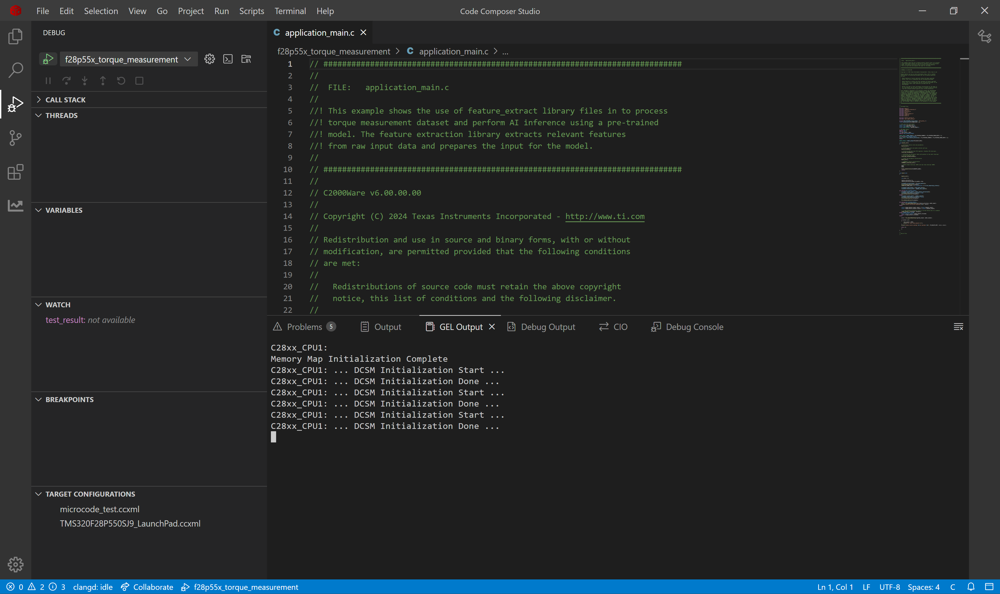
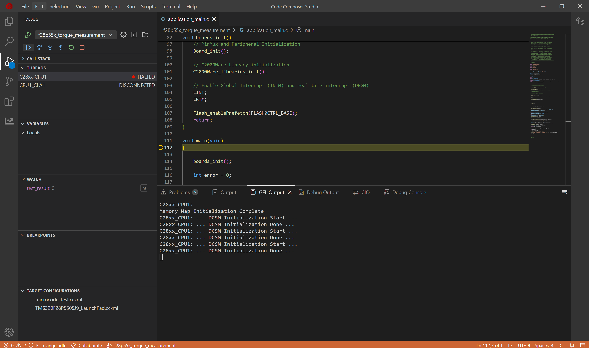
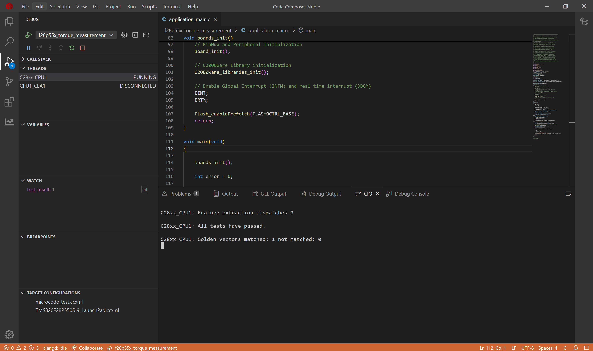

# Torque Measurement on C28x Devices

## 1. Purpose

Predicting rotor torque in motors presents a significant engineering challenge: direct measurement requires costly sensors that add weight, a critical concern for electric vehicles striving for efficiency. While traditional statistical methods for estimating rotor torque and temperature exist, they are limited by the need for domain expertise and motor-specific tuning, offering no universal solution. This project leverages deep learning to efficiently predict rotor torque in permanent magnet synchronous motors (PMSM), enabling a substantial reduction in the hardware sensors required for motor instrumentation and control.

This project demonstrates implementation of an AI-based torque measurement system on TI C28x microcontrollers. It showcases how to deploy machine learning models for real-time torque measurement in embedded systems, helping in understanding the torque applied by the system. The onboard hardware accelerates AI processing faster than software implementations. Complementing this hardware advantage, TI provides a complete development ecosystem with toolchains and SDKs that significantly streamline all stages of Edge AI solution development.

## 2. Dataset & AI Model Details

### 2.1 **Dataset**

The original dataset we took contains sensor measurements collected from a **Permanent Magnet Synchronous Motor (PMSM)** running on a controlled test bench. The motor is a prototype model from a German OEM, and the measurements were collected by the **LEA department at Paderborn University**. All signals are sampled at **2 Hz** (two samples per second). You can find the original dataset and its full description here:  [Electric Motor Temperature (Kaggle)](https://www.kaggle.com/wkirgsn/electric-motor-temperature)

**Columns:**
| Column Name | Description |
|------------------|-------------|
| `i_d` | Current d-component (active component) |
| `i_q` | Current q-component (reactive component) |
| `u_d` | Voltage d-component (active component) |
| `u_q` | Voltage q-component (reactive component) |
| `motor_speed` | Motor speed |
| `ambient` | Ambient temperature |
| `coolant` | Coolant temperature |
| `pm` | Permanent magnet surface temperature |
| `stator_winding` | Stator winding temperature |
| `stator_tooth` | Stator tooth temperature |
| `stator_yoke` | Stator yoke temperature |
| `torque` | Torque induced by current |

After studying the problem, we discovered that we only need to measure a few things that are already easy to get: **Ambient temperature (`ambient`), Coolant temperature (`coolant`), Voltage components (`u_d`,`u_q`), Phase current Magnitude `i_a` ($i_{a} = \sqrt{i_d^2 + i_q^2}$)**. Based on these values we will predict the torque induced

Each file is a CSV (Excel format) with the following structure:

**Example data (csv): Normal Operation**
```csv
u_q,coolant,stator_winding,u_d,stator_tooth,motor_speed,i_d,i_q,pm,stator_yoke,Target
-0.4507,18.8052,19.0867,-0.3501,18.2932,0.0029,0.0044,0.0003,24.5542,18.3165,0.1871
-0.3257,18.8186,19.0924,-0.3058,18.2948,0.0003,0.0006,-0.0008,24.5381,18.315,0.2454
-0.4409,18.8288,19.0894,-0.3725,18.2941,0.0024,0.0013,0.0004,24.5447,18.3263,0.1766
-0.327,18.8356,19.083,-0.3162,18.2925,0.0061,0.0,0.002,24.554,18.3308,0.2383
-0.4712,18.857,19.0825,-0.3323,18.2914,0.0031,-0.0643,0.0372,24.5654,18.3267,0.2082
```

### 2.2 **Model Architecture**

This regression model `REGR_10k` contains approximately 10,000 parameters and follows a streamlined architecture consisting of three convolutional layers (each enhanced with BatchNorm and ReLU activation functions) followed by two linear layers. The model is specifically designed to be fully compatible with TI's Neural Processing Unit (NPU) specifications as documented in the [NPU compliance guidelines](https://software-dl.ti.com/mctools/nnc/mcu/users_guide/), adhering to the required m4 channel configuration and maintaining kernel heights of 7 or less.

### 2.3  **Input Features**

The model takes 4D input (N,C,H,W)
  - N (1)    : batch size which is restricted to 1
  - C (10)   : channels which is 10 for multiple parameters
  - H (128)  : samples of timeseries DC current which is 128 in this example
  - W (1)    : width of samples is restricted to 1 for timeseries applications

### 2.4 **Output Classes**

This model produces a 1D output representing the one continuous value of torque.

### 2.5 **Performance Metrics**

The AI model's memory requirements differ significantly when targeting CPU versus NPU execution. Flash memory stores the model's core components (weights, biases, and architectural definition), while SRAM provides the working memory needed for runtime operations, including input processing and output storage. These memory footprints vary based on the chosen processing unit implementation.

| Configuration | FLASH (B) | SRAM (B) |
|---------------|-----------|----------|
|      CPU      |   12387   |   3202   |
|      NPU      |   13699   |   3220   |

## 3. Project Structure
```
|_ torque_measurement
    |_ application_main.c         # Main application containing API calls to Feature Extraction and AI Model
    |_ user_input_config.h        # Flags representing Feature Extraction to apply on the raw input from sensors
    |_ test_vector.c              # Test cases to verify working of Feature Extraction and AI model on device
    |_ lnk.cmd                    # Defines utilization of memory banks
    |_ artifacts
        |_ mod.a                  # Contains the compiled AI model
        |_ tvmgen_default.h       # Exposing APIs to use AI model and model definition
    |_ feature_extract
        |_ feature_extract_c28.c  # Implementation of optimized FFT function
        |_ feature_extract.c      # Implementation of feature extraction
        |_ feature_extract.h      # Exposing APIs to use feature extraction
```

## 4. Feature Extraction Used

Feature extraction transforms raw data into meaningful inputs for our AI model. For this torque measurement system, we aren't applying any feature extraction to the raw dataset, but we are using a function from Feature extraction library which is normalization.

The feature extraction pipeline is configured in the user_input_config.h file, where various processing flags (prefixed with FE_) control the data transformation. Below is the breakdown of the user_input_config:

- **SKIP_NORMALIZE**: Converts the floating point input into fixed point input for the AI model.

Within test_vector.c, we've included sample readings of dataset. The visualizations below demonstrate how our feature extraction pipeline transforms these raw signals.

## 5. How to Recreate AI Model

To develop an AI model for arc fault detection, we need a complete workflow that includes dataset loading, pre-processing, model training, validation, and exporting with metadata. TI offers two toolchain options for this process: Edge AI Studio or TinyML Modelzoo. This example demonstrates how to use Modelzoo to generate the necessary artifacts and golden vectors for deployment on C28x devices.

### 5.1 Modelzoo

Setting up modelzoo can be found [here](https://github.com/TexasInstruments/tinyml-tensorlab/tree/main/tinyml-modelzoo).

#### 5.1.1 Step-by-step guide to use TI Modelzoo for model creation

```bash
./run_tinyml_modelzoo.sh examples/torque_measurement_regression/config.yaml
```
- **run_tinyml_modelzoo.sh** : represents the script invoking the modelzoo, takes one argument which is the path of yaml
- **examples/torque_measurement_regression/config.yaml** : path of configuration file to execute

After executing the above command, you can see the modelzoo starts working according to the yaml file passed to it. In the logs you can observe the following
- Downloading the dataset
- Training of the AI Model
- Quantization Aware Training of the AI model
- Performance of the exported quantized model on test data
- Compilation of the model using [TI Neural Network Compiler for MCUs](https://software-dl.ti.com/mctools/nnc/mcu/users_guide/index.html)

At the end of the logs you can find the path of compiled model.

#### 5.1.2 Exporting the model for C28x deployment

From executing the above command you can find the results stored in tinyml-modelmaker. The results for a particular instance have path in the following manner:

- tinyml-modelmaker/data/projects/torque_measurement/run/**20260122-102510**/REGR_10k

The directory marked bold represents the time at which the script was invoked. The target device (such as c28x) has four useful file outputs by ModelMaker.

- `mod.a`: The ONNX model is compiled by tvm to get C files, which are converted into a single mod.a that can run on device.
- `tvmgen_default.h`: Mod.a exposes few APIs to interact with model which are present here. You can use these APIs in your application to run model

- `test_vector.c`: ModelMaker gives a test dataset and the expected output. You can use the model to inference this test dataset and check if the output is matching. 
- `user_input_config.h`: This configuration file has preprocessing flag definitions for the parameters used for feature extraction.

### 5.2 CCS Project

#### 5.2.1 Creating a new project in Code Composer Studio

- Install the [C2000Ware SDK](https://www.ti.com/tool/C2000WARE)
- In research explorer, search for torque_measurement_regression project
- Import the project
- Replace the files in CCS Project with the ones generated from modelmaker.

#### 5.2.2 Compiled model files

- mod.a: The compiled model is present in this file. 
  - Path Modelmaker: *tinyml-modelmaker/data/projects/torque_measurement/run/20260122-102510/REGR_10k/compilation/artifacts/mod.a*
  - Path CCS Project: *torque_measurement_f28p55x/artifacts/mod.a*
- tvmgen_default.h: Header file to access the model inference APIs from mod.a 
  - Path Modelmaker: *tinyml-modelmaker/data/projects/torque_measurement/run/20260122-102510/REGR_10k/compilation/artifacts/tvmgen_default.h*
  - Path CCS Project: *torque_measurement_f28p55x/artifacts/tvmgen_default.h*

#### 5.2.3 Feature Extraction configuration & Test data for device verification

- test_vector.c: Test cases to check if the model works on device currently
  - Path Modelmaker: *tinyml-modelmaker/data/projects/torque_measurement/run/20260122-102510/REGR_10k/training/quantization/golden_vectors/test_vector.c*
  - Path CCS Project: *torque_measurement_f28p55x/test_vector.c*
- user_input_config.h: Configuration of feature extraction library in SDK. 
  - Path Modelmaker: *tinyml-modelmaker/data/projects/torque_measurement/run/20260122-102510/REGR_10k/training/quantization/golden_vectors/user_input_config.h*
  - Path CCS Project: *torque_measurement_f28p55x/user_input_config.h*

#### 5.2.4 Building the application

After preparing the project, we'll build and flash it to the C28x device. The main application logic resides in 'application_main.c', which contains the code responsible for configuring the feature extraction library and executing the arc fault detection model inference.

1. Now we will build the project. Go to Project Tab -> Select Build Project(s)

2. Connect launchpad F28P55x to your system.

## 6. Deploying on C28x Device

Now we will flash the built project on the device. We will use debug mode to see the result of model inference present in *test_result*.

3. Switch the active target device from **TMS320F28P550SJ9.ccxml** to **TMS320F28P550SJ9_LaunchPad.ccxml**.

4. Flash the built project in device. Go to Run tab -> Select Flash Project

5. After the application is flashed, debug screen will appear. Select the debug icon.

6. Continue the program in debug mode.

7. In the CIO tab of CCS Studio, you can see that 'All tests have passed'



## 7. Performance Analysis

We conducted performance profiling of both the Feature Extraction Library and the AI model on the f28p55x device. The measurements below show the processing cycles required for each component. Note that these values will vary across different devices of c28x. 

| Configuration | FE Cycles | FE Time (us) |  AI Model Cycles | Inference Time (us) |
|---------------|-----------|--------------|------------------|---------------------|
|      CPU      |  204867   |    1365.78   |       765682     |       5104.55       |
|      NPU      |  204867   |    1365.78   |       110248     |        734.99       |

Notably, the AI model executes 11.7 times faster when running on the NPU compared to CPU implementation.

<hr>
Update history:
[22nd Jan 2026]: Compatible with v1.3 of Tiny ML Modelmaker
