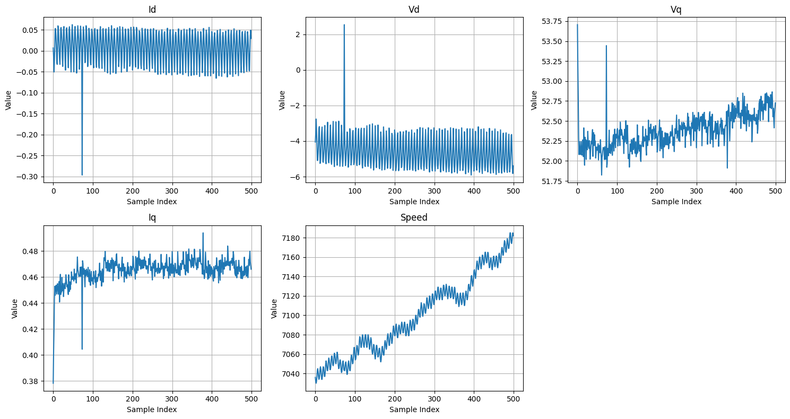
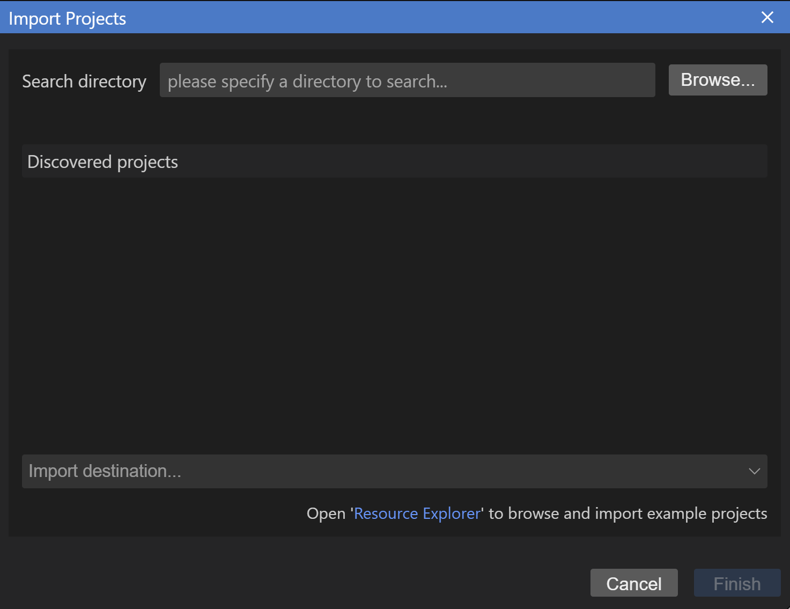
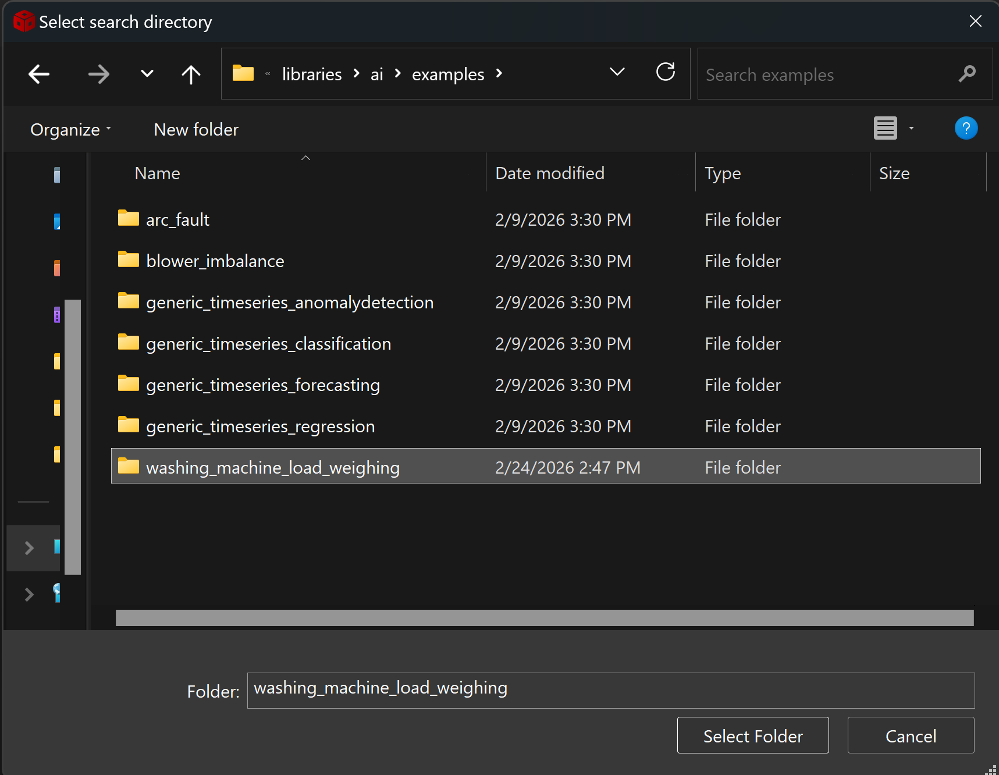
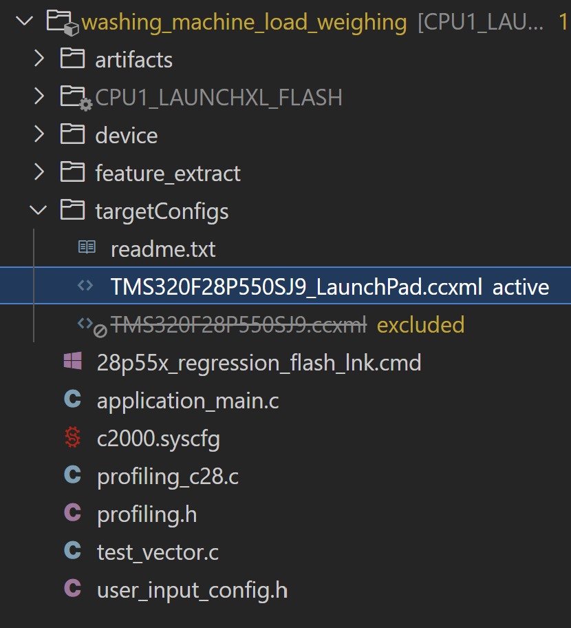
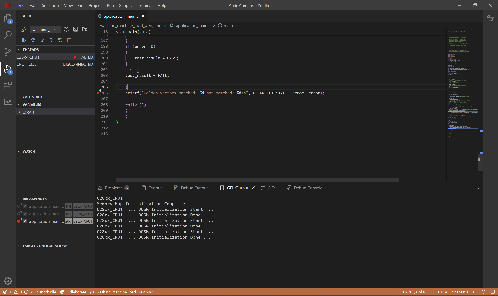
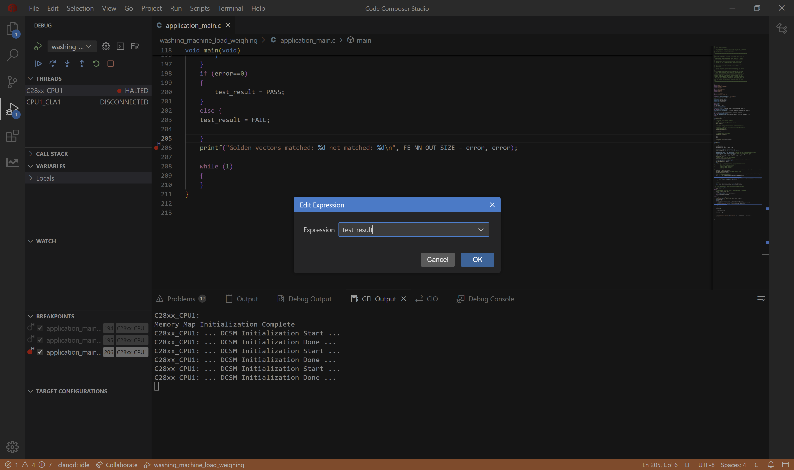
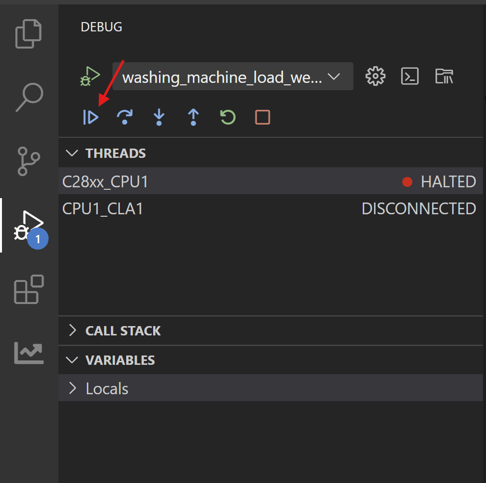
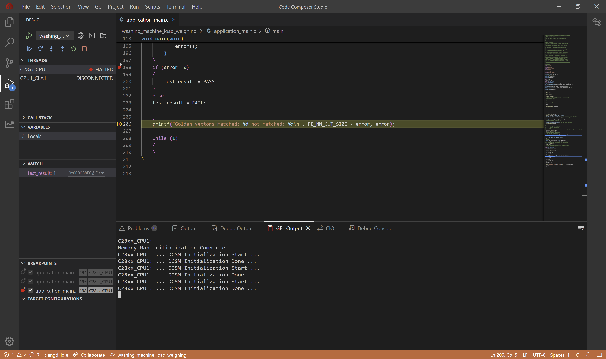

# Washing Machine Load Weighing on C28x Devices

## 1. Purpose

Prediction of weight of clothes in a washing machine eliminates the need for a weight sensor, which is typically required for automatic water level adjustment, thereby reducing manufacturing costs. We utilize machine learning models that take into account various features such as voltage, current, and speed of the washing machine to predict the weight of the clothes. This approach ensures that the water level can be adjusted accurately without relying on a physical weight sensor, which can be prone to mechanical failure. By doing so, we provide a cost-effective and reliable sensor-less solution that enhances the overall performance and efficiency of the washing machine, while also reducing the risk of mechanical failure due to sensor malfunction.

## 2. Dataset & AI Model Details

### 2.1 **Dataset**

The dataset consists of 6 current, voltage and speed based features. The dataset is obtained from TI Lab. We have dataset of 100g precision from 0g to 900g, i.e. weight values are from 0g to 900gm with intervals of 100g.

The variables in the dataset are as follows :  

| Variable Name | Description |
|----------|----------|
| Vd |  Voltage component along d-axis   |
| Id  | Current component along d-axis |
| Vq | Voltage component along q-axis |
| Iq | Current component along q-axis |
| Iqref | Reference Current |
| Speed | Speed of the washing machine motor |


Each file is a CSV (Excel format) with the following structure:

**Columns:**
- Column 1: Vd
- Column 2: Id
- Column 3: Vq
- Column 4: Iq
- Column 5: Iqref
- Column 6: Speed


**Example data (csv):**
```csv
Vd,Id,Vq,Iq,Iqref,Speed
-4.088643551,0.004390597,53.72555541992188,0.3875175416469574,0.4844396114349365,6983
-4.965218067,0.043295942,53.35862350463867,0.404801995,0.4844396114349365,6989
-5.001141548,0.044437885,52.82765579223633,0.4291702210903168,0.4844396114349365,6994
-4.644256592,0.028175261,52.40491485595703,0.448510081,0.4844396114349365,6993
-4.000966549,-0.00066736,52.30049514770508,0.453502893,0.4844396114349365,6989
```

### 2.2 **Model Architecture**

Here we have a CNN based model, with 13k parameters consisting of 3 convolution layers and 2 fully connected layers. The model is partially quantized, i.e. the input batch norm layer and first convolution layer, and the last linear layer are in float, while other layers are in int8. The quantized layers are compatible with TI's Neural Processing Unit (NPU) specifications as documented in the [NPU compliance guidelines](https://software-dl.ti.com/mctools/nnc/mcu/users_guide/).
### 2.3  **Input Features**

The model takes 4D input (N,C,H,W)
  - N (1)    : batch size which is restricted to 1
  - C (6)    : channels which is 6 for the features
  - H (512)  : samples of timeseries signals which is 512 in this example
  - W (1)    : width of samples is restricted to 1 for timeseries applications

### 2.4 **Output**

This model produces a 1D output representing the weight of the clothes in the washing machine.


## 3. Project Structure
```
|_ washing_machine_load_weighing
    |_ application_main.c         # Main application containing API calls to Feature Extraction and AI Model
    |_ user_input_config.h        # Flags representing Feature Extraction to apply on the raw input from sensors
    |_ test_vector.c              # Test cases to verify working of Feature Extraction and AI model on device
    |_ lnk.cmd                    # Defines utilization of memory banks
    |_ artifacts
        |_ mod.a                  # Contains the compiled AI model
        |_ tvmgen_default.h       # Exposing APIs to use AI model and model definition
    |_ feature_extract
        |_ feature_extract_c28.c  # Implementation of optimized FFT function
        |_ feature_extract.c      # Implementation of feature extraction
        |_ feature_extract.h      # Exposing APIs to use feature extraction
```

## 4. Feature Extraction 

Feature extraction transforms raw data into meaningful inputs for our AI model. For this regression task, our experimental testing revealed that applying any feature extraction did not tremendously give better performances than directly using input raw signal. However, we have used a SimpleWindow transformation, which makes usage of the previous frame_size 512 is used in this example, to predict the current instance of target variable.

### 4. Raw Data 


The images show the raw signal of different features w.r.t. sample index for 500 datapoints. 


## 5. How to Recreate AI Model

To develop an AI model for regression, we need a complete workflow that includes dataset loading, pre-processing, model training, validation, and exporting with metadata. TI offers two toolchain options for this process: Edge AI Studio or TinyML Modelzoo. This example demonstrates how to use Modelzoo to generate the necessary artifacts and golden vectors for deployment on C28x devices.

### 5.1 Modelzoo

Setting up modelzoo can be found [here](https://github.com/TexasInstruments/tinyml-tensorlab/tree/main/tinyml-modelzoo).

#### 5.1.1 Step-by-step guide to use TI Modelzoo for model creation

```bash
./run_tinyml_modelzoo.sh examples/reg_washing_machine/config.yaml
```
- **run_tinyml_modelzoo.sh** : represents the script invoking the modelzoo, takes one argument which is the path of yaml
- **examples/reg_washing_machine/config.yaml** : path of configuration file to execute

After executing the above command, you can see the modelzoo starts working according to the yaml file passed to it. In the logs you can observe the following
- Downloading the dataset
- Performing Simple Windowing
- Training of the AI Model
- RMSE of the exported model on test data
- Compilation of the model

At the end of the logs you can find the path of compiled model.

#### 5.1.2 Exporting the model for C28x deployment

From executing the above command you can find the results stored in tinyml-modelmaker. The results for a particular instance have path in the following manner:

- tinyml-modelmaker/data/projects/reg_washing_machine/run/**{date-time}**/REGR_13k

The directory marked bold represents the time at which the script was invoked. The target device (such as c28x) has four useful file outputs by ModelMaker.

- `mod.a`: The ONNX model is compiled by tvm to get C files, which are converted into a single mod.a that can run on device.
- `tvmgen_default.h`: Mod.a exposes few APIs to interact with model which are present here. You can use these APIs in your application to run model

- `test_vector.c`: ModelMaker gives a test dataset and the expected output. You can use the model to inference this test dataset and check if the output is matching. 
- `user_input_config.h`: This configuration file has preprocessing flag definitions for the parameters used for feature extraction.

### 5.2 CCS Project

#### 5.2.1 Creating a new project in Code Composer Studio

- Install the [C2000Ware SDK](https://www.ti.com/tool/C2000WARE)
- Open Code Composer Studio
- Import the project
  - Go to **File** > **Import Projects**
  - A dialog box will appear. Click **Browse** to select the project folder.
  - 

- Select the `washing_machine_load_weighing` folder from    
  ```
     {C2000Ware_SDK_INSTALL_PATH}/libraries/ai/examples/washing_machine_load_weighing
     ```
     

     - Click Finish

- Verify Project Import

  - After importing, the project should appear in the **Project Explorer** panel on the left side of CCS.

  


- Replace the files in CCS Project with the ones generated from modelmaker.

#### 5.2.2 Compiled model files

- mod.a: The compiled model is present in this file. 
  - Path Modelmaker: *tinyml-modelmaker/data/projects/reg_washing_machine/run/{date-time}/REGR_13k/compilation/artifacts/mod.a*
  - Path CCS Project: *washing_machine_load_weighing/artifacts/mod.a*
- tvmgen_default.h: Header file to access the model inference APIs from mod.a 
  - Path Modelmaker: *tinyml-modelmaker/data/projects/reg_washing_machine/run/{date-time}/REGR_13k/compilation/artifacts/tvmgen_default.h*
  - Path CCS Project: *washing_machine_load_weighing/artifacts/tvmgen_default.h*

#### 5.2.3 Feature Extraction configuration & Test data for device verification

- test_vector.c: Test cases to check if the model works on device currently
  - Path Modelmaker: *tinyml-modelmaker/data/projects/reg_washing_machine/run/{date-time}/REGR_13k/training/quantized/golden_vectors/test_vector.c*
  - Path CCS Project: *washing_machine_load_weighing/test_vector.c*
- user_input_config.h: Configuration of feature extraction library in SDK. 
  - Path Modelmaker: *tinyml-modelmaker/data/projects/reg_washing_machine/run/{date-time}/REGR_13k/training/quantized/golden_vectors/user_input_config.h*
  - Path CCS Project: *washing_machine_load_weighing/user_input_config.h*

#### 5.2.4 Building the application

After preparing the project, we'll build and flash it to the C28x device. The main application logic resides in 'application_main.c', which contains the code responsible for configuring the feature extraction library and executing the inference.

1. In the Project Explorer, expand your project
2. Find the **targetConfigs** folder
3. Right-click on the LaunchPad configuration file (e.g., `TMS320F28P550SJ9_LaunchPad.ccxml`)
4. Select **Set as Active Target Configuration**
5. Right-click on the target configuration > **Build Project**
6. Wait for the build to complete. Check the **Console** panel for any errors.

## 6. Deploying on C28x Device

Now we will flash the built project on the device. 

1. Right click on target config > **Flash Project**

2. After flashing, the debug perspective should open automatically. If not, go to **Run** > **Debug**
3. Add a breakpoint at the line as shown in the image below


4. Add a watch variable, test_result as shown in the image


5. Click the **Resume** button (blue play button).

&nbsp;&nbsp;&nbsp;&nbsp;

6. If the test_result is 1 it means the model inference is working correctly, if it is 0, the model inference is wrong.


## 7. Performance Analysis

We conducted performance profiling of the AI model on the f28p55x device. The measurements below show the processing cycles required. Note that these values will vary across different devices of c28x. 

| Configuration |   Model Cycles | Inference Time (us) |
|---------------|-----------|--------------|
|      CPU      |   7907534   | 52716.89  |
|      CPU+NPU      |   2803410   |   18689.4    |

Here, the CPU+NPU model is the partially quantized model, wherein the input batch norm, first convolution layer and the last linear layer are in float and all other layers are in int8. The quantized layers are running on the NPU whereas the float layers still run on the CPU.

We observe that the CPU+NPU model is faster compared to the CPU model

<hr>
Update history:
[24th Feb 2026]: Compatible with v1.3 of Tiny ML Modelmaker