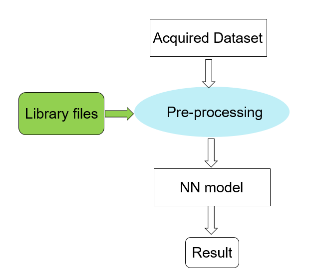
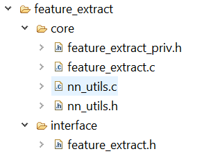
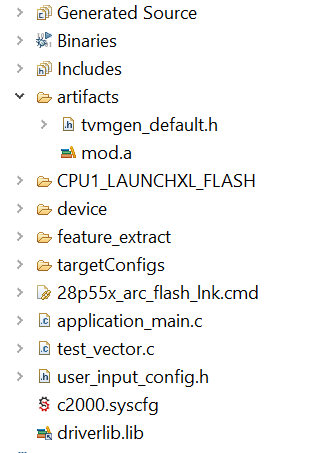
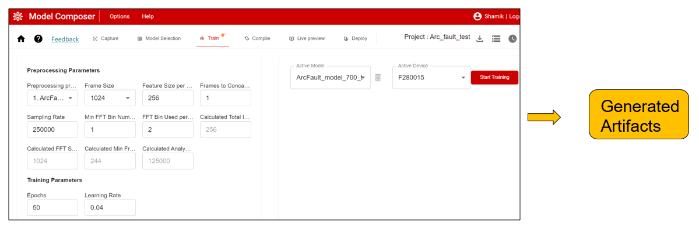
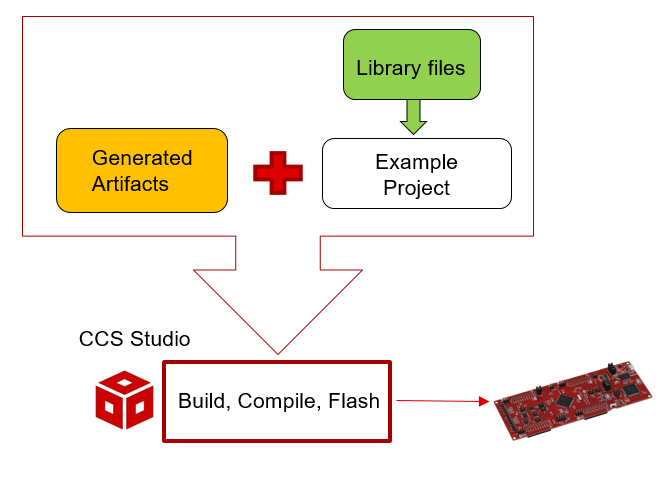
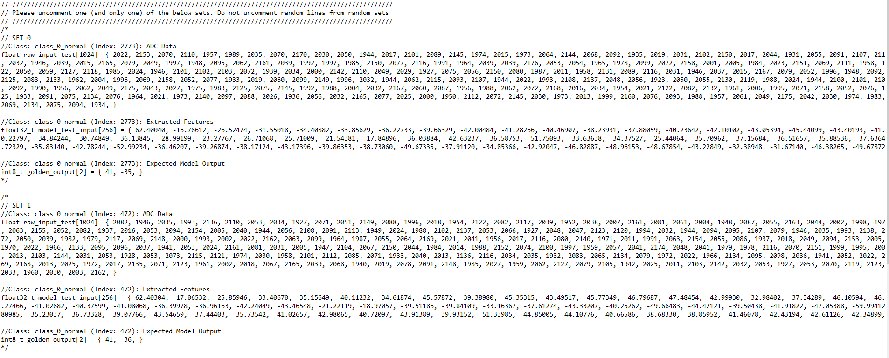

# User guide for feature_extract library example projects v1
This library contains source code for feature extraction processes to be used in  neural network(NN) / AI based user applications. Feature extraction is some times used as a pre-processing stage to feed input into a Neural Netwroks - this library provides a collection of such feature extraction algorithms.



To use it with your own Neural Network model, it is recommended to use  [TI's Edge AI Studio / Model Composer](https://www.ti.com/tool/EDGE-AI-STUDIO) or [Tiny ML ModelMaker](https://github.com/texasinstruments/tinyml-tensorlab) which generates the preprocessing configurations and Neural Network artifacts.

The source files are categorized into two broader categories:
1. Core implementation fuctions --> To take care of all backend operation. User need not call these functions directly
2. User interface --> User are supposed to call APIs from these files and make relevant changes for their project



## Example projects list
Example projects are also provided - these example projects can be used standalone with the files provided here. These are example projects are to demonstrate the functionality of this library and are not meant for production. 

There are total three example projects provided to demonstrate how to use this library. The examples are:
1. ex_arc_fault_dataset_validation_f28004x  --> This example is to show how to use feature extraction library files for arc fault detection (using a time series classification Nerural Network) in f28004x (Launchpad/Control Card). It uses the following feature extraction type:
    * `FEATURE_EXTRACT_WIN_FFT_BIN`
2. ex_arc_fault_dataset_validation_f28p55x -->
This example is to show  how to use feature extraction library files for arc fault detection (using a time series classification Nerural Network) in f28p55x (Launchpad/Control Card) It uses the following feature extraction type:
    * `FEATURE_EXTRACT_WIN_FFT_BIN`
3. ex_motor_fault_dataset_validation_f28p55x -->
This example is to show  how to use feature extraction library files for motor fault detection (using a time series classification Nerural Network) in f28p55x (Launchpad/Control Card). This same project can be used to demonstate the use of four feature extration types. These types are: 
        * `FEATURE_EXTRACT_RAW`
        * `FEATURE_EXTRACT_FFT`
        * `FEATURE_EXTRACT_FFT_BIN with 1D dataset`
        * `FEATURE_EXTRACT_FFT_BIN with 2D dataset`

## Example project structure
These example project contains six stages apart from generic device initialization:-

### `Step 1: Parameter assigment` 
```
    // initialize feature extract
    Feature_Extract_Init_Params init_params;

    //Essential initial parameter declaration for the example code to run
    init_params.version = 1;
    #if defined(FE_RAW)
    init_params.type = FEATURE_EXTRACT_RAW;
    #elif defined(FE_FFT) && !defined(FE_BIN) && !defined(FE_WIN)
    init_params.type = FEATURE_EXTRACT_FFT;
    #elif defined(FE_FFT) && defined(FE_BIN) && !defined(FE_WIN)
    init_params.type = FEATURE_EXTRACT_FFT_BIN;
    #elif defined(FE_FFT) && defined(FE_BIN) && defined(FE_WIN)
    init_params.type = FEATURE_EXTRACT_WIN_FFT_BIN;
    #endif
    init_params.num_frame_concat = FE_NUM_FRAME_CONCAT;
    init_params.feature_size_per_frame = FE_FEATURE_SIZE_PER_FRAME;
    init_params.output_feature_width = NN_WL;
    init_params.output_feature_height = NN_HL;
    init_params.num_input_channels = FE_STACKING_CHANNELS;
    init_params.total_feature_size_per_frame = (init_params.feature_size_per_frame)*(init_params.num_input_channels);
    #if !defined(FE_RAW)
    {
        init_params.fft_stage_num = FE_FFT_STAGES;
    }
    #else
    {
        init_params.fft_stage_num = 0;
    }
    #endif
    init_params.fft_size = FE_FFT_SIZE;
    init_params.nn_output_size = FE_NN_OUT_SIZE;
    init_params.size_of_frame = FE_FRAME_SIZE;
    init_params.output_convert_bias = tvmgen_default_bias_data;
    init_params.output_convert_scale = tvmgen_default_scale_data;
    init_params.output_convert_shift = tvmgen_default_shift_data;
    init_params.output_convert_shift_len = sizeof(tvmgen_default_shift_data) / sizeof(tvmgen_default_shift_data[0]);
    init_params.output_feature_size_per_channel = (init_params.num_frame_concat)*(init_params.feature_size_per_frame);
    init_params.output_feature_size = init_params.output_feature_size_per_channel*init_params.num_input_channels;

    //These initializations apply only in the cases that uses FFT. That is why they are conditional.
    #ifdef FE_FFT_BIN_SIZE
    init_params.fft_bin_size = FE_FFT_BIN_SIZE;
    #else
    init_params.fft_bin_size = 0;
    #endif
    #ifdef FE_MIN_FFT_BIN
    init_params.min_fft_bin_size = FE_MIN_FFT_BIN;
    #else
    init_params.min_fft_bin_size = 1;
    #endif
```

### `Step 2: Buffer allocation for handling data while performing feature extraction` 
```
    #pragma DATA_SECTION(scratch_buffer, "FFT_buffer_1")
    #define SCRATCH_BUFFER_LEN (FE_FFT_SIZE*8)
    #define SCRATCH_BUFFER_SIZE (SCRATCH_BUFFER_LEN*sizeof(float))
    float scratch_buffer[SCRATCH_BUFFER_LEN];
```

Make sure that the scratch_buffer that we allocated is sufficient in size by calling alloc_feature_extract:
```
    Feature_Extract_Alloc_Params alloc_params;
    alloc_feature_extract(&init_params, &alloc_params);
    ASSERT(SCRATCH_BUFFER_SIZE >= alloc_params.scratch_size);
    ASSERT(sizeof(Feature_Extract_Handle_Params) >= alloc_params.handle_size);
```

### `Step 3: Now initialize the feature_extract handle using init_params`

```
    Feature_Extract_Handle_Params handle_params;
    init_feature_extract(&init_params, &handle_params);
```

### `Step 4: Execute the run_feature_extract`
Assign nessesary buffer to handle input data(`input_buffer`), intermediate data (`scratch_buffer`), output data(`output_buffer`) and execute the run_feature_extract: 

```
    void *input_buffer = raw_input_test;
    void *output_buffer = &nnData.nn_input_int.data[0][0][0];
    void *scratch_buffer1 = scratch_buffer;

    run_feature_extract(&handle_params, input_buffer, output_buffer, scratch_buffer1);
```

### `Step 5: Run inference in the Neural Network model`

Assign output of feature extraction stage as an input to the NN model and run the NN model to check for the result.

```
    // Run NN model
    struct tvmgen_default_inputs inputs = { (void*) &nnData.nn_input_int.data[0][0][0] };
    struct tvmgen_default_outputs outputs = { &nnData.nn_output_int.buf0[0] };
    tvmgen_default_run(&inputs, &outputs);
```

### `Step 6: Classify using the Neural Network outputs`
```
    softmax_cal(nnData.nn_output_int.buf0, FE_NN_OUT_SIZE, nnData.softmax); // Compute softmax
    nnData.class_detected = classification_cal(nnData.softmax, FE_NN_OUT_SIZE, 0.5); // Compute classification
```

## How to run reconfigured model from the example project

Use either of the options mentioned below:

### Option 1: Plug & play option

The example projects are already preloaded with reference model artifacts. 
* These are created for a particular configuration on a specific dataset
* You will have to use  the aforementioned tools to create the equivalents for your own setup.



* `user_input_config.h` file contains all necessary parameter definations required for the project. 
* `test_vector.c` contains all the reference test vector for corresponding NN model. 

* `artifacts` folder contains necessary NN model information. These files are the one which is going to be regenerated everytime user trains a new model in `TI's TinyML Modelmaker` or `TI's Model Composer`. 

User can already execute the example projects as it is with the existing fileset. Else they can simply replace the existing  `user_input_config.h`, `test_vector.c`, `tvmgen_default.h`, `mod.a` files with regenerated files and run the code. 





Note: While using the regenerated `test_vector.c` file, user needs to comment out any one set of data as directed below:-
 

### Option 2: Mode change option in example project with pre-attached fileset

`ex_motor_fault_dataset_validation_f28p55x` example project contain the artifacts of `FEATURE_EXTRACT_FFT_BIN with 2D dataset` by default.

#### To run this example code for `FEATURE_EXTRACT_RAW` mode:
1. Please make following change in pre-attached `user_input_config.h`:-

```
//#define FE_FFT
//#define FE_BIN
#define FE_RAW
#define NN_INPUT_DIM_2D1
//#define NN_INPUT_DIM_1D
```

2. Replace the files from `artifacts` folder with the corresponding files present in `$C2000WARE/libraries/ai/feature_extract/c28/models/raw/artifacts`

#### To run this project in `FEATURE_EXTRACT_FFT` mode:-
1. Please make following change in pre-attached `user_input_config.h`:-

```
#define FE_FFT
//#define FE_BIN
//#define FE_RAW
#define NN_INPUT_DIM_2D1
//#define NN_INPUT_DIM_1D
```


2. Replace the files from `artifacts` folder with the corresponding files present in `$C2000WARE/libraries/ai/feature_extract/c28/models/fft/artifacts`

#### To run this project in `FEATURE_EXTRACT_FFT_BIN with 1D dataset` mode:-
1. Please make following change in pre-attached `user_input_config.h`:-
```
#define FE_FFT
#define FE_BIN
//#define FE_RAW
//#define NN_INPUT_DIM_2D1
#define NN_INPUT_DIM_1D
```

2. Replace the files from `artifacts` folder with the corresponding files present in `$C2000WARE/libraries/ai/feature_extract/c28/models/fftbin_1d/artifacts`

Note: `NN_INPUT_DIM_2D1 & NN_INPUT_DIM_1D` are for internal usage only to distinguish between parameter definition in pre-attached `user_input_config.h` file. 
* *Modelmaker/ Model Composer generated `user_input_config.h` file will not contain this macro definition.*

 `2D dataset` stands for dataformat of `(number of channels, feature size)` input dataset. `1D dataset` stands for dataformat of `(1, [number of channels x feature size])` input dataset. 