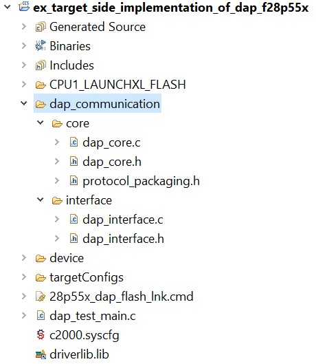
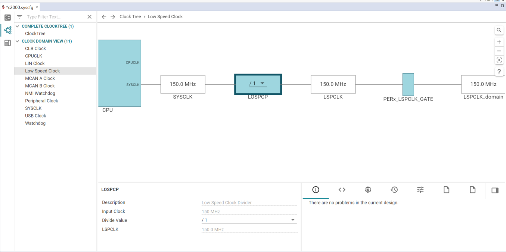
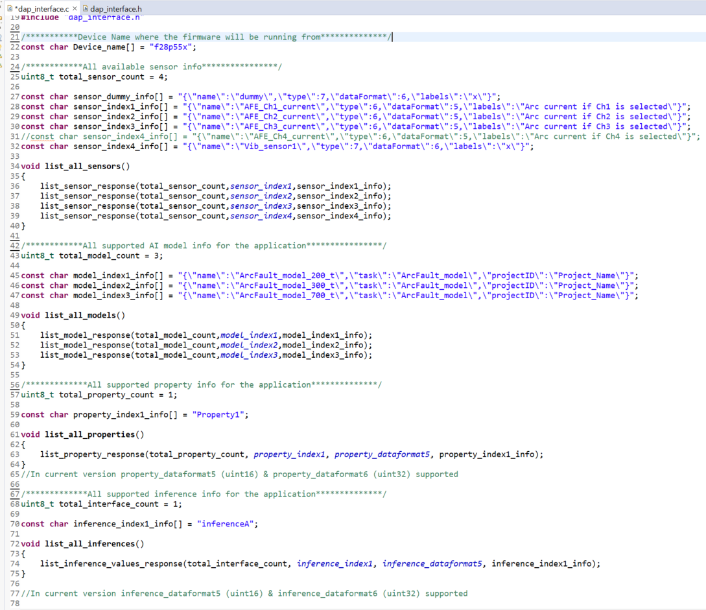
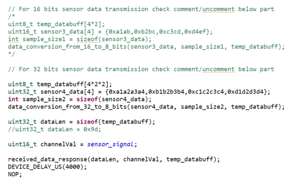
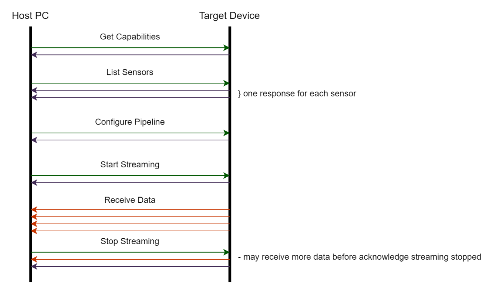

# User guide for target_host_comm_protocol library example projects v1
This library contains source code for target side implementation of device agent protocol(dap) to be used to communicate with web-based host GUI.

The source files are categorized into two broder categories:-
1. Core implementation fuctions --> To take care of all backend operation. User need not call these functions directly
2. User interface functions --> User are supposed to call APIs from these files and make relevant changes for their project



## Example project list
The following example projects created for user reference to guide them how to use the library files:
1. `ex_target_side_implementation_of_dap_f28p55x`

## How to run the example project

### `Step 1: Set baud rate & property value datatype macro`

In the `dap_interface.h` file set the following macro for necessary baud rate and datatype of property value:-
```
#define SCI_BAUD_RATE 2343750         // 37.5Mhz/16
//#define SCI_BAUD_RATE 9375000         // 37.5Mhz/16 *4
//#define SCI_BAUD_RATE 4687500         // 37.5Mhz/16 *2

#define PROPERTY_VAL_TYPE_UINT16    1   //default value is 1
#define PROPERTY_VAL_TYPE_UINT32    0   //default value is 0
```

Note: Maximum possible baud rate with default `LSPCLK` configuration (`LSPCLK=SYSCLK/4`) is `2343750`. If user wants to run the code for higher baud rate like 4687500 or 9375000, they need to change LSPCLK value from clocktree configuration as shown below:-



### `Step 2: sensor, model, property, inference info and device name update`

In the `dap_interface.c` update the relevant information support by the application environment as shown below:-



Note: Property value of `uint16_t` and `uint32_t` only supported in this version to support read_property/write_property command response

### `Step 3: sensor, model, property, inference info and device name update`

Construct the test data array in `dap_test_main.c` file and call the `data_conversion_from_16_to_8_bits(uint16_t* input_buf, int input_buf_size, uint8_t* output_buf)`/`data_conversion_from_32_to_8_bits(uint32_t* input_buf, int input_buf_size, uint8_t* output_buf)` as per the test datatype to convert them in `uint8_t` format. Finally call the `received_data_response(uint32_t data_payload_length, uint16_t channel_value, uint16_t* data_array)` API to execute data transmission:



Example usecase of packet tramission between host & target will be similar as shown below where host will always initiate the command & target will respond back to that accordingly.



## Reference

1. Details regarding the protocal is documented in: https://confluence.itg.ti.com/display/EDGEST/Serial+Communication+Protocol#SerialCommunicationProtocol-DataFormat.1